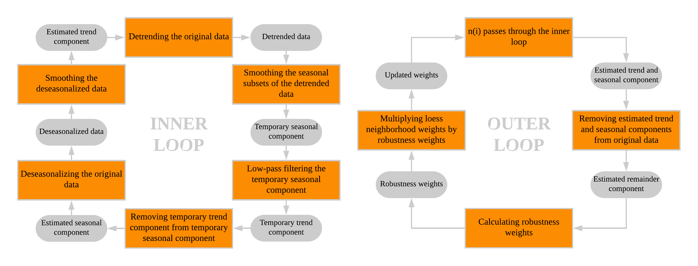

```{r setup, include=FALSE}
knitr::opts_chunk$set(echo = FALSE)
knitr::opts_chunk$set(out.width = "\\textwidth")
```

This chapter presents a brief introduction to the theory of time series analysis. It is meant to serve as a theoretical foundation of the concepts used in this thesis. Therefore, the focus is clearly on those specific concepts, and the chapter should to no means be considered a thorough overview of the complete field of study.

The chapter is divided into five sections. In the first section, a formal definition of time series is given. The second section discusses the main characteristics of time series. Section three describes the different components of time series data and presents methods to split a time series into these components. The fourth section introduces statistical models to forecast time series, in particular the *autoregressive integrated moving average* (ARIMA) class of models. Finally, the fifth section focuses on a specific niche within time series analysis that is used in this thesis, namely time series clustering.

# 2.1 Time series definition

According to @woodward2017, a time series can be defined as follows:

**Definition 1** A *time series* is a special type of a stochastic process. A stochastic process {$Y(t); t \in T$} is a collection of random variables, where $T$ is an index set for which all of the random variables are defined on the same sample space. When $T$ represents time, the stochastic process is referred to as a time series. $\blacksquare$

Typically, observations are made at equally spaced time intervals, such as every hour, every day or every year. In such cases, $T$ takes on a discrete set of values, and we refer to them as *discrete-time time series*. On the other hand, *continuous-time time series* arise when $T$ takes on a continuous range of values [@brockwell2002]. In this thesis, only discrete-time time series are analyzed.

An observed realization of the stochastic process described in Definition 1, is referred to by @woodward2017 as a *realization of a time series*. Other works, such as @brockwell2002, @shumway2011 and @hyndman2018fpp, use the term *time series* for both the data and the stochastic process of which it is a realization. In this thesis, for the sake of simplicity, the latter approach is used, and no notational distinction is made. 

**Definition 2** A *time series* is a set of observed values {$y_{t}$} of a stochastic process {$Y(t); t \in T$}, where $T$ represents time. $\blacksquare$

From the context it will be clear whether the term time series refers to the process (Definition 1) or its realization (Definition 2). When clarification is needed, it is given locally.

# 2.2 Time series characteristics
## 2.2.1 Autocorrelation
Analyzing time series raises unique problems in statistical modelling and inference. In conventional statistics, methods rely on the assumptions of independent and identically distributed random variables. However, in time series analysis, observations made at nearby moments in time are likely to be related. That is, it is likely that there exist internal relationships within a time series. If these relationships are linear, they are called autocorrelation, as defined in Definition 3 [@shumway2011]. 

**Defintion 3** *Autocorrelation* measures the linear correlation between two points on the same time series observed at different times. $\blacksquare$

Given a sample {$y_{1}, y_{2}, ... , y_{n}$} of a time series, the degree of dependence in the data can be assessed by computing the *autocorrelation function* (ACF), for each lag $h$, as defined in Equation 1 [@brockwell2002].

$$ \hat\rho(h) = \frac{\hat\gamma(h)}{\hat\gamma(0)}, \quad -n < h < n $$

Where $\hat\gamma(h)$ is the autocovariance function of the sample at lag $h$, as defined in Equation 2.

$$ \hat\gamma(h) = n^{-1}\sum_{t=1}^{n-|h|}(y_{t+|h|} - \bar{y})(y_{t} - \bar{y}), \quad -n < h < n $$

Where $n$ is the length of the sample, $y_{t}$ is the data value at time $t$, $y_{t-|h|}$ is the data value at time $t$ minus $|h|$ time periods, and $\bar{y}$ is the mean of the sample. Whenever a time series {$Y_{t}$} is stationary, a concept that is introduced in the next section, the ACF of the sample {$y_{t}$} can be used as an estimate for the ACF of {$Y_{t}$}. A time series without autocorrelation, with zero mean and finite variance, is called *white noise*.

Conventional statistical methods can not be appropriately applied to data that exhibit autocorrelation, since the independency assumption is violated. The primary objective of time series analysis, therefore, is to develop mathematical models that are appropriate to use for data with a temporal autocorrelation structure [@shumway2011]. Furthermore, autocorrelation is in some cases an advantage, since an internal dependence structure implies that past observations can be used adequately to forecast future values.

## 2.2.2 Stationarity
In time series analysis, a key role is played by time series whose statistical properties do not vary with time [@brockwell2002]. Such time series are referred to as *stationary time series*. The most restrictive form of stationarity is defined in Definition 4 [@woodward2017].

**Definition 4** A time series {$Y(t); t \in T$} is *strictly stationary* if for any $t_{1}, t_{2}, ..., t_{k} \in T$ and any $h \in T$, the joint distribution of {$Y_{t_{1}}, Y_{t_{2}}, ..., Y_{t_{k}}$} is identical to that of {$Y_{t_{1+h}}, Y_{t_{2+h}}, ..., Y_{t_{k+h}}$}. $\blacksquare$

However, it is often too hard to mathematically establish the requirement of strict stationarity, since the involved distributions are not known. For most applications, a milder form of stationarity, which only imposes conditions on the first and second moment of a time series, is sufficient. This is officially known as *weak stationarity*, but, in time series analysis, usually just called *stationarity*. It is mathematically defined as in Definition 5 [@woodward2017].

**Definition 5** A time series {$Y(t); t \in T$} is *stationary* if

$\quad \text{1) } E[Y_{t}] = \mu \quad (\text{constant for all }t)$.

$\quad \text{2) } Var[Y_{t}] = \sigma^{2} \quad (\text{constant for all }t)$.

$\quad \text{3) } \gamma(t_{1}, t_{2}) \text{ depends only on } t_{2} - t_{1}$. $\blacksquare$

In words, this means that a time series is said to be stationary when the mean and variance are constant over time, and the autocovariance function only depends on the difference between two time points, and not on the time point itself. Note here that each time series that is strictly stationary (Definition 4), is, by definition, also stationary (Definition 5). 

Stationarity is important, since in real-world problems, it is common that only one realization of a time series is available. That means that each random variable in the time series is represented by a single value. This makes it impossible to get an understanding of the underlying probability distributions of those random variables, unless it is assumed that their statistical properties are the same (i.e. the time series is stationary). In that case, the statistical properties of the whole sample can be used to estimate the statistical properties of each individual probability distribution. An understanding of the underlying probability distributions, in turn, is especially important when the goal is to forecast how the time series will behave at future time points. When the statistical properties of the time series have been constant over time in the past, one can simply predict that they will remain constant in the future.

In most practical applications, non-stationary time series are the rule rather than the exception. Luckily, by applying mathematical transformations, it often possible to render a non-stationary time series as, approximately, stationary. This process is referred to as *stationarizing* a time series [@nau2018]. Stationarizing is used a lot in statistical forecasting methods, which are discussed in section 2.4.

## 2.2.3 Spectral entropy
Often, two separate approaches to time series analysis are defined. The first, referred to as the *time domain*, deals primarily with the internal dependence structure in time series data, where current values can be explained in terms of a dependence on past values, as discussed in section 2.2.1. The second, referred to as the *frequency domain*, works with a spectral representation of the time series, in which the original data is expressed as a weighted sum of sine and cosine waveforms, each with their own frequency. Named after the French mathematician Jean-Baptiste Joseph Fourier, such a representation is commonly known as a *Fourier representation* or *Fourier series*, and its corresponding sine and cosine terms as *Fourier terms*.  Forecasting is inherently tied to the time domain of time series analysis, which will therefore be the focus of this thesis. However, there is no schism dividing the two approaches. That is, some frequency domain techniques can be useful even in the time domain, and vice versa [@shumway2011].

One of such techniques is the calculation of the spectral entropy of a time series, which describes the order and regularity of a time series, based on its Fourier representation. The spectral entropy of a time series can be calculated with Equation 2.x.

$$ H = \int_{-\pi}^{\pi} \hat{f}(\lambda)\log \hat{f}(\lambda)d\lambda$$

Where $\hat{f}_{y}(\lambda)$ is the estimated spectral density function, which describes the importance of the different frequencies in the Fourier representation of the time series. Usually, $H$ is normalized to the range of values between 0 and 1. For a detailed description of the calculations, see @goerg2013. Spectral entropy is useful in forecasting, since it can serve as a quantative measure of the forecastability of a time series. Data that are easy to forecast, will have a small value of $H$, while very noisy data will have a large value of $H$ [@talagala2018].

# 2.3 Time series components
## 2.3.1 Definitions
A time series can consist of various underlying patterns. Each of those patterns is considered a distinct component of the time series, with its own properties and behaviour. Splitting a time series into its components is known as *time series decomposition*. It enables a separate analysis of all the components, which helps to better understand the dynamics of a time series, but can also be useful in forecasting, as is showed later in this chapter.

@hyndman2018fpp define three main components of a time series: a trend-cycle component, a seasonal component and a remainder component. For simplicity, the trend-cycle component is usually called just the trend component, which is done in this thesis as well.

**Definition 4** The *trend component* is the combination of the trend and cyclical pattern of a time series. A trend exists when there is a long-term, not necessarily linear, increase or decrease in the data. A cyclical pattern occurs when the data exhibit rises and falls that are not of a fixed frequency. $\blacksquare$

**Definition 5** The *seasonal component* contains the seasonal pattern of a time series. A seasonal pattern occurs when a time series is affected by seasonal factors such as the time of the year or the day of the week. Seasonality is always of a fixed and known frequency. $\blacksquare$

**Definition 6** The *remainder component* is the remaining variation in a time series after the trend and seasonal components are removed. $\blacksquare$ 

There exist several different methods for the decomposition of a time series. Most of them are based on the classical decomposition method, which is discussed in the next section. A more sophisticated approach is known as STL, and is covered in section 2.2.2.3.

## 2.3.2 Classical decomposition
The oldest and simplest method for the decomposition of a time series is referred to as classical decomposition by @hyndman2018fpp. They present a stepwise approach for the use of the method, which is summarized in this section. Classical decomposition can be applied in two different forms. In the additive form, a time series is assumed to be the sum of its components, as shown in Equation 2.

$$ y_{t} = T_{t} + S_{t} + R_{t} $$

In the multiplicative form, a time series is assumed to be the product of its components, as shown in Equation 3.

$$ y_{t} = T_{t} \times S_{t} \times R_{t} $$

Where, for both Equation 2 and Equation 3, $y_{t}$ is the data, $T_{t}$ is the trend component, $S_{t}$ is the seasonal component and $R_{t}$ is the remainder component. 

Additive decomposition is the appropriate form when the amplitude of the variation around the trend is relatively constant. On the other hand, when the amplitude of the variation around the trend changes with the level of the trend, multiplicative decomposition should be used.

In both the additive and multiplicative form of classical decomposition, the first step is to estimate the trend component. This is done by smoothing the data with a symmetric moving average filter of order $m$, where $m$ is a non-negative integer. That is, the estimate of the trend component at time $t$ is the average of all the data values within a window of $m$ time periods centered at $t$, as shown in Equation 4. Usually, $m$ is set to be equal to the seasonal period of the time series, which, in turn, is the number of observations per seasonal cycle. For example, when working with daily data that show a weekly seasonal pattern, the seasonal period is 7. 

$$ \hat{T}_{t} = \frac{1}{m}\sum_{j=-k}^{k}y_{t+j} $$ 

Where $k = (m-1)/2$. The detrended time series data are then calculated by removing the estimated trend component from the original data. In the case of additive decomposition by subtraction, $y_{t} - \hat{T}_{t}$, and in the case of multiplicative decomposition by division, $y_{t}/\hat{T}_{t}$.

The seasonal component is estimated by averaging the detrended data values per season, as shown in Equation 5. Using again the example of daily data with a weekly seasonal pattern, that would mean that the estimated seasonal component for a specific Monday is the average value of all Monday observations in the data set, the estimated seasonal component for a specific Tuesday is the average value of all Tuesday observations in the data set, and so on. 

$$ \hat{S}_{t} = \frac{1}{n_{t}}\sum_{i=1}^{n_{t}}(\omega_{t})_{i} $$ 

Where $\omega_{t}$ is a vector containing all the detrended values belonging to the same season as $y_{t}$, and $n_{t}$ is the length of $\omega_{t}$. Usually, the estimated seasonal component values for each season are adjusted such that they add up to 0 in the case of additive decomposition and 1 in the case of multiplicative decomposition.

Finally, the remainder component is estimated by removing both the estimated trend component and the estimated seasonal component from the original time series. For additive decomposition, this is done by applying Equation 6.

$$ \hat{R}_{t} = y_{t} - \hat{T}_{t} - \hat{S}_{t} $$

For multiplicative decomposition, Equation 7 is used.

$$ \hat{R}_{t} = \frac{y_{t}}{\hat{T}_{t}\hat{S}_{t}} $$

Classical decomposition is generally praised for its simplicity, but has several disadvantages compared to some of the more modern decomposition methods [@hyndman2018fpp]. As a consequence of the use of a symmetric moving average filter, there are no trend component estimates available for the first few and last few observations of the time series. Therefore, also the remainder component estimate lacks these values. This is mainly problematic when forecasting, as is showed later in this chapter. Furthermore, the seasonal component stays constant over all the seasonal cycles, and cannot capture slight changes over time. Especially when working with longer time series, this may be an inappropriate representation of the truth. Finally, classical decomposition is not robust to extreme values in the data.

## 2.3.3 STL decomposition
A widely used method that is based on classical decomposition, but deals with many of the limitations mentioned above, is known as STL. It stands for *A Seasonal-Trend decomposition procedure based on Loess*, and was developed by @cleveland1990. In this section, their methodology is summarized. STL estimates all three components for every observation in a time series, and can also handle missing values in the data. Both the trend and seasonal component are robust and not distorted by extreme values. Furthermore, the seasonal component is not fixed, but can vary slightly over time.

As its name already implies, STL is based on loess, also known as locally-weighted regression. Loess was developed by @cleveland1988, and is a non-parametric regression technique, often used for smoothing, that fits weighted least squares regression curves to local subsets of a data set. Joining them together forms the loess regression curve $\hat{g}(x)$. More specifically, for each value of $x$, $\hat{g}(x)$ is computed in the following way. First, a positive integer $q$ is chosen, which defines the neighbourhood width. That is, the $q$ observations that are closest to $x$ are selected as neighbours of $x$. Each of these observations is given a weight based on its distance to x, in a way that the closest observations get the highest weight.  Let $W$ be the tricube weight function as defined in Equation 8.

$$
W(u) = 
    \begin{cases}
      (1 - u^{3})^{3} &\quad 0 \leq u < 1\\
      0 &\quad u \geq 1\\
    \end{cases}
$$

Then, the neighbourhood weight for each observation $x_{i}$ is calculated with Equation 9.

$$ \upsilon_{i} = W\Bigg(\frac{|x_{i} - x|}{\lambda_{q}(x)}\Bigg) $$

Where $\lambda_{q}(x)$ is the distance of the $q$th farthest observation from $x$. Then, $\hat{g}(x)$ is calculated by fitting a polynomial regression of degree $d$ to x, using weighted least squares with the neighbourhood weights $\upsilon_{i}$. Usually, $d$ is either $1$ or $2$, corresponding respectively to a locally-linear regression and a locally-quadratic regression. Since the loess regression curve is smooth, there is no need to compute $\hat{g}(x)$ at all possible values of $x$. In general, the computation of $\hat{g}(x)$ as described above is only performed at a finite set of locations, and interpolated elsewhere.

STL uses loess for several smoothing operations, that, when performed on a time series, lead to estimations of the trend, seasonal and remainder components of the data. The method is build up of two loops: an inner loop nested inside an outer loop. In the inner loop, the estimates of the seasonal and trend component are updated once, in a stepwise manner, which is described below. 

**Step 1.** The inner loop starts with computing the detrended time series data $y_{t} - \hat{T}_{t}$ from the original time series data $y_{t}$. In the initial pass through the inner loop, there is no estimation of $T_{t}$ yet, and $\hat{T}_{t}$ is set equivalent to $0$. That is, it is assumed there is no trend at all. This may be a rather poor estimate, but inside the loop, it will soon be updated to something more reasonable. In all successive passes through the loop, the estimated trend component that resulted from the previous loop is used.

**Step 2.** In the second step, the detrended time series is split up into subsets, with each subset containing all the data belonging to one specific season. That is, there will be $n_{p}$ different subsets, where $n_{p}$ is the number of observations per seasonal cycle. Each of those subsets is smoothed by loess, with $q = n_{s}$ and $d = 1$. $n_{s}$ is referred to as the seasonal smoothing parameter and its value must be chosen by the analyst. It basically determines how much the seasonal component is allowed to change over time. High values of $n_{s}$ allow little variation, while low values can lead to overfitting. The smoothed values of all the subsets are then binded back together into a temporary seasonal component $C_{t}$. Each end of $C_{t}$ is extended $n_{p}$ positions, such that $C_{t}$ has $2 \times n_{p}$ observations more than the original time series.

**Step 3.** In the third step, any trend that may have contaminated $C_{t}$ is identified. This is done by applying a sequence of smoothers, called a low-pass filter, to $C_{t}$. It starts with a moving average of length $n_{p}$, followed by another moving average of length $n_{p}$, followed by a moving average of length 3, followed by a loess smoothing with $q = n_{l}$ and $d = 1$. Just as earlier with $n_{s}$, the low-pass filter smoothing parameter $n_{l}$ should be chosen by the analyst. The output of the third step is called $L_{t}$. Since moving averages are used, the first $n_{p}$ observations and the last $n_{p}$ observations of $C_{t}$ will not have a smoothed value in $L_{t}$. However, this was already accounted for by extending $C_{t}$ in step 2. That is, $L_{t}$ is again of the same length as the original time series.

**Step 4.** In the fourth step, the seasonal component is estimated by detrending the temporary seasonal component. That is, $\hat{S}_{t} = C_{t} - L_{t}$.

**Step 5.** In the fifth step, the deseasonalized time series data $y_{t} - \hat{S}_{t}$ are computed from the original time series data $y_{t}$. 

**Step 6.** In the sixth and last step of the inner loop, the estimation of the trend component, $\hat{T}_{t}$, is calculated by loess smoothing the deseasonalized time series with $q = n_{t}$ and $d = 1$. The trend smoothing parameter $n_{t}$ should be chosen by the analyst. 

The outer loop of STL starts with $n_{i}$ iterations of the inner loop. The estimations of the trend and seasonal components that follow from the passes through the inner loop, are used to estimate the remainder component with Equation 10.

$$ \hat{R}_{t} = y_{t} - \hat{T}_{t} - \hat{S}_{t} $$

For each observation in the time series, a robustness weight is calculated. This weight reflects how extreme the value of the remainder component of that observation is, in a way that a very extreme value is given a very low, or even zero, weight. Let $B$ be the bisquare weight function as defined in Equation 11. 

$$
B(u) = 
    \begin{cases}
      (1 - u^{2})^{2} &\quad 0 \leq u < 1\\
      0 &\quad u \geq 1\\
    \end{cases}
$$

Then, the robustness weight at time point $t$ is calculated with Equation 12.

$$ \rho_{t} = B\Bigg(\frac{|R_{t}|}{6median(|R_{t}|)}\Bigg) $$

After the first pass of the outer loop, the next iteration starts again with $n_{i}$ passes through the inner loop. However, in the loess smoothing in step 2 and step 6, each neighbourhood weight $\upsilon_{t}$ is now multiplied by its corresponding robustness weight $\rho_{t}$, such that extreme values have less influence on the estimates of the trend and seasonal components. Also, the estimated trend component that resulted from the last inner loop in the previous outer loop, is now used as first value of $\hat{T}_{t}$, rather than $0$. In total, the outer loop is carried out $n_{o}$ times.

STL is designed for additive decomposition. However, a multiplicative version can be obtained by first log transforming the data, and finally back-transforming the components. This is based on the logarithm product rule, which states that $log(a) + log(b)$ is equivalent to $log(a \times b)$ [@hyndman2018fpp].

The complete methodology of STL as described above is summarized in Figure 1.

```{r stl, fig.cap = 'Summary of the STL methodology', fig.pos = 'h'}

```

## 2.3.3 Strength of trend and seasonal components
`*NOTE: Provide formulas for calculating the strength of the trend and seasonal components*`

# 2.4 Time series forecasting
## 2.4.1 Forecasting models
Often, the main aim of time series analysis is to forecast future values of a time series. In some cases, this can be done by using external exploratory variables. One could for example try to forecast the profit of ice cream sales by using air temperature as an exploratory variable in a linear regression model. However, there are several reasons not to forecast time series in this way, as summed up by @hyndman2018fpp. Firstly, the underlying system of the forecasted time series may not be sufficiently understood, and even if it is, the relations with exploratory variables may be too complex. Secondly, when forecasting future values of a time series, also the future values of the exploratory variables should be known, which means that each exploratory variable should be forecasted separately before the response variable can be forecasted. This may be too difficult to do accurately, and even when it is possible, it remains a very time consuming task. Especially when the only aim is to know what will happen, and not why it will happen, it is not worth the effort. Finally, modelling a time series with conventional statistical method like linear regression will likely result in model errors that exhibit autocorrelation, which implies that such models are not able to capture all the dynamics of the data. Thus, produced forecast are not as efficient, and, probably, not as accurate as can be.

Instead, in time series analysis, the internal dependence structure of a time series is used to forecast future values as a function of the current and past values [@shumway2011]. Obviously, this primarily requires a good understanding of that structure, which is obtained by describing the process that generated the data with a time series model, as defined in Definition 7, adapted from @brockwell2002.

**Definition 7** A *time series model* for an observed realization {$y_{t}$} of a time series {$Y_{t}$} is a specification of the joint distributions, or possibly only the means, variances and covariances, of the random variables that {$Y_{t}$} comprises. $\blacksquare$

One of the most famous and widely used groups of time series models is known as the *autoregressive integrated moving average* (ARIMA) class of models, developed by @box1970. In this thesis, ARIMA is used as well. The next section gives a summary of its theory, based on @brockwell2002, Chapter 5, @shumway2011, Chapter 3, and @hyndman2018fpp, Chapter 3 and 8.

## 2.4.2 ARIMA
### 2.4.2.1 Structure
An ARIMA model is a combination of an *autoregressive* (AR) and *moving average* (MA) model, preceded by a differencing operation on the original data. An autoregressive model of order $p$, commonly referred to as an AR($p$) model, is based on the assumption that the current value of a time series is a linear combination of $p$ previous values, as showed in Equation 13.

$$ y_{t} = \phi_{1}y_{t-1} + \phi_{2}y_{t-2} + ... + \phi_{p}y_{t-p} + \epsilon_{t} $$

Where $y_{t}$ is the current value of the time series at time period $t$, $\epsilon_{t}$ is the random error (i.e. white noise) at time $t$, $\phi_{1},...,\phi_{p}$ are model parameters.

A moving average model of order $q$, commonly referred to as an MA($q$) model, is based on the assumption that the current value of a time series is a linear combination of $q$ previous errors, as showed in Equation 14.

$$ y_{t} = \epsilon_{t} + \theta_{1}\epsilon_{t-1} + \theta_{2}\epsilon_{t-2} + ... + \theta_{q}\epsilon_{t-q} $$

Where $y_{t}$ is the current value of the time series at time period $t$, $\epsilon_{t}$ is the error at time period $t$, which is assumed to be white noise, and $\theta_{1},...,\theta_{q}$ are model parameters.

AR($p$) and MA($q$) models can be combined into an autoregressive moving average model of order ($p$, $q$), commonly referred to as ARMA($p$, $q$). That is, in such a model, the current value of a time series is a linear combination of both $p$ previous values and $q$ previous errors, as showed in Equation 15.

$$ 
y_{t} = \phi_{1}y_{t-1} + ... + \phi_{p}y_{t-p} + \theta_{1}\epsilon_{t-1} + ... + \theta_{q}\epsilon_{t-q} + \epsilon_{t} 
$$

ARMA($p$, $q$) models require the forecasted time series to be stationary. When working with non-stationary time series, it is often possible to stationarize the series by differencing it one or more times. The first order difference of a time series is the series of changes from one time period to the next, as shown in Equation 16.

$$ \nabla y_{t} = y_{t} - y_{t-1} $$

Where $\nabla y_{t}$ is the first order difference of $y_{t}$. When the first order difference is still non-stationary, the second order difference $\nabla^{2}y_{t}$ can be computed by taking again the first order difference of $\nabla y_{t}$, and so on. The original non-stationary time series that needed to be differenced in order to get stationary, is called an *integrated* version of the stationary series. That is why a model that first stationarizes the data by applying a $d$-th order difference, before fitting an ARMA($p$, $q$) model, is called an autoregressive integrated moving average model of order ($p$, $d$, $q$), commonly referred to as ARIMA($p$, $d$, $q$). That is, in such a model, the current value of the $d-$th order difference of a time series is a linear combination of both $p$ previous values and $q$ previous errors, as showed in Equation 17.

$$ 
\nabla^{d}y_{t} = \phi_{1}\nabla^{d}y_{t-1} + ... + \phi_{p}\nabla^{d}y_{t-p} + \theta_{1}\epsilon_{t-1} + ... + \theta_{q}\epsilon_{t-q} + \epsilon_{t} 
$$

Where $\nabla^{d}y_{t}$ is the $d$-th order difference of $y_{t}$. Note here that ARIMA($p$, $d$, $q$) is a general form of all the other models discussed earlier in this section. For example, an AR(1) model can also be written as ARIMA(1,0,0), an ARMA(2,1) as ARIMA(1,0,2), and so on.

The process of finding an appropriate ARIMA($p$, $d$, $q$) model that represents a time series is known as the Box-Jenkins modelling procedure and consists of three stages, named model selection, parameter estimation and model checking. All these stages are described separately in the next three subsections.

### 2.4.2.2 Model selection
In the model selection stage, $p$, $d$ and $q$ are chosen. In this process, $d$ is selected first, such that the choice of $p$ and $q$ will be based on a stationary time series. An appropriate value for $d$ can be found by inspecting the plotted data $y_{t}$, with time on the x-axis, and define visually if the data are stationary. If not, then difference the data once, and inspect the plot of $\nabla y_{t}$. If $\nabla y_{t}$ does not seem stationary either, take the second-order difference $\nabla^{2} y_{t}$, and so on. In general, however, it is not recommended to difference more than two times. As an addition to the time plots, plotting the sample autocorrelation function of the data can help to identify stationarity. Non-stationary data show a slow decay in autocorrelation as the time lag increases, while for stationary data, the autocorrelation will drop to zero relatively fast. 

Once $d$ has been set, either $p$ or $q$ can be selected by inspecting the autocorrelation function plot and the partial autocorrelation function plot of the differenced data, which respectively plot the sample autocorrelation function (ACF), defined in Equation 2.x, and the sample partial autocorrelation function (PACF), for several lags $h$. The PACF is the relationship between an observation at time $t$ and and observation at time $t-k$, removing the effects of all time lags in between, i.e. $1, 2, ..., k-1$. Then, appropriate values for either $p$ or $q$ are found with the following rules of thumb:

* The PACF plot of an ARIMA($p$,$d$,$0$) process cuts of after lag $p$, and the ACF plot tails off.
* The ACF plot of an ARIMA($0$,$d$,$q$) process cuts of after lag $q$, and the PACF plot tails off.

When dealing with ARIMA($p$, $d$, $q$) processes where both $p > 0$ and $q > 0$, the ACF plot and PACF plot will both tail off, and finding appropriate values for $p$ and $q$ turns into a trial-and-error approach, where models with different combinations of $p$ and $q$ are compared.

The methodology as described above is used often, but involves a lot of manual interventions. This makes it a rather subjective way of working, that is labour intensive, especially when a large number of time series needs to be modelled, and requires expert knowledge. Therefore, several automated approaches to select $p$, $d$ and $q$ have been proposed. One of them is the Hyndman-Khandakar algorithm, which methodology is summarized below, in a simplified way. For the full details, see @forecast.

**Step 1.** To define $d$,  the Hyndman-Khandakar algorithm uses the Kwiatkowski-Phillips-Schmidt-Shin (KPSS) test, which is a statistical test used to determine stationarity of a time series. Only if there is enough statistical evidence, the null hypothesis that the time series is stationary will be rejected, and the time series is instead considered to be non-stationary. The detailed mathematics underlying the test can be found in @kwiat1992.

Using the KPSS test, first, the original data $y_{t}$ are tested for stationarity. When $y_{t}$ are considered stationary, $d = 0$, and when considered non-stationary, the first-order differenced data $\nabla y_{t}$ are tested for stationarity. Again, when $\nabla y_{t}$ are considered stationary, $d = 1$, and when considered non-stationary, the second-order differenced data $\nabla^{2} y_{t}$ are tested for stationarity. This process is repeated until a stationary series is obtained.

**Step 2.** In the second step, four different models are fitted to the $d$-times differenced data.

* An ARIMA($0$, $d$, $0$) model.
* An ARIMA($1$, $d$, $0$) model.
* An ARIMA($0$, $d$, $1$) model.
* An ARIMA($2$, $d$, $2$) model.

Then, the model with the lowest AIC is selected. AIC, which stands for Aikake's Information Criterion, is a measure for the goodness-of-fit of a model, and can be calculated with Equation 2.x.

$$ AIC = -2 \log(L) + 2k$$

Where $L$ is the likelihood of the data, and $k$ is the number of free parameters in the model. In this case, $k = p + q + l + 1$, where $l = 1$ when a non-zero constant is included, and $l = 0$ otherwise. The '$+1$' term is included, since the variance of the residuals is also a parameter. To find the best fitting model, AIC should be minimized. The idea behind AIC is the following. The likelihood monotonically increases when more parameters are added to the model, and therefore, only maximizing the likelihood would favor a model that overfits the data. AIC prevents such overfitting, by penalizing the likelihood with a term that is proportional to the number of parameters used in the model.

**Step 3.** In the third step, several variations of the model that was selected in step 2, are fitted to the $d$-times differenced data. These variations include:

* Models where either $p$ or $q$ vary $\pm 1$ from the selected model, given that $p, q \ngtr 5$.
* Models where both $p$ and $q$ vary $\pm 1$ from the selected model, given that $p, q \ngtr 5$.

From the selected model and all its variations, the model with the lowest AIC is chosen to be the new selected model, and step 3 is repeated. The algorithm stops when there are no variations of the selected model that have a lower AIC. In that case, the selected model is the optimal model, and forms the output of the Hyndman-Khandakar algorithm. The complete methodology of the algorithm as described above is summarized in Figure 2.x.

```{r hyndman, fig.cap = 'Summary of the Hyndman-Khandakar algorithm', fig.pos = 'h'}
knitr::include_graphics('Figures/hyndman.png')
```

### 2.4.2.3 Parameter estimation
When $p$, $d$ and $q$ are defined, the model parameters $\phi_{1},...,\phi_{p}$ and $\theta_{1},...,\theta_{q}$ need to be estimated. Usually, this is done with *maximum likelihood estimation* (MLE). The likelihood is the probability of obtaining the observed data, given the model and specific parameter values. The parameter values that maximize the likelihood are called the maximum likelihood estimators of the true parameters, and will be used as the parameter estimates in the fitted ARIMA($p$, $d$, $q$) model, which then is referred to as the maximum likelihood ARIMA($p$, $d$, $q$) model. The detailed mathematical description of MLE for ARIMA models can be found in @brockwell2002, section 5.2.

Note here that the Hyndman-Khandakar algorithm already produces a fitted model as output, and the parameter estimation as described in this section is done inside the algorithm, each time a model is fitted to the $d$-times differenced data.

### 2.4.2.4 Model checking
Model checking involves identifying if the fitted model is adequate. This is done by inspecting its residuals, which are defined as the difference between the actual observations and the corresponding fitted values, as shown in Equation 2.x.

$$ \epsilon_{t} = y_{t} - \hat{y}_{t} $$

If the maximum likelihood ARIMA($p$, $d$, $q$) model is the true process that generated the data, the residuals should be completely white noise. Recall, however, that the model is an estimation of the true process. Therefore, a good model that fits the data well, should have residuals with properties that *approximately* reflect those of white noise, i.e. a zero mean and no autocorrelation. If autocorrelation is present in the residuals, this means that there is still information left in the data, which could be used to create more accurate forecasts. A non-zero mean will lead to biased forecasts. 

Autocorrelation in the residuals can be detected by a visual interpretation of the residual ACF plot, which will always show some autocorrelation, due to random variation. Therefore, given that $n$ is the length of the modelled time series, and assuming a normal distribution, the residuals are considered to be uncorrelated when for at least 95% of the time lags, the residual ACF lies within the interval $[-1.96/\sqrt{n}, 1.96/\sqrt{n}]$.

Usually, several computations within the model fitting and forecasting process build on the assumption that the data come from a normally distributed population. For example, in MLE and the calculation of AIC, Gaussian likelihood is commonly used. Furthermore, prediction intervals of forecasts are in general derived from the normal distribution. Normally distributed residuals indicate that these assumptions were valid, and are therefore a valuable property of a model. However, as stated by @brockwell2002, using Gaussian likelihood is sensible even when the data are not normally distributed.

### 2.4.2.5 Forecasting
A fitted ARIMA($p$, $d$, $q$) model can then be used to forecast the future values of a time series. To do so, Equation 2.x is rewritten, such that the current value of the time series, $y_{t}$, is replaced by a future value of the time series, $y_{t+h}$, as showed in Equation 2.x.

$$ 
\nabla^{d}y_{t+h} = \hat\phi_{1}\nabla^{d}y_{t+h-1} + ... + \hat\phi_{p}\nabla^{d}y_{t+h-p} +\hat\theta_{1}\epsilon_{t+h-1} + ... + \hat\theta_{q}\epsilon_{t+h-q} + \epsilon_{t+1} 
$$

Where $h$ is the forecast horizon, i.e. the number of time lags ahead at which the forecast is made, $p$, $d$ and $q$ are known and constant, and $\hat\phi_{1},...,\hat\phi_{p}$ and $\hat\theta_{1},...,\hat\theta_{q}$ are the estimated parameter values, which are also constant.

When $h > 1$, more than one forecast has to be made. For example, the forecast of $\nabla^{d}y_{t+2}$, the value of the time series two time lags ahead, is based on $\nabla^{d}y_{t+2-1}$, the value of the time series one time lag ahead. Therefore, $\nabla^{d}y_{t+2-1}$ needs to be forecasted first, before $\nabla^{d}y_{t+2}$ can be forecasted. In general, this means that the uncertainty of the forecasts increases as $h$ increases. This uncertainty is expressed by means of a prediction interval. Most often, the 95% prediction interval is used. Assuming normally distributed residuals, the lower and upper bound of the 95% prediction interval for the $h$-step forecast can be calculated with Equation 2.x and 2.x, respectively.

$$ \ell = \hat{y}_{t+h} - 1.96\hat\sigma_{h}$$
$$ \upsilon = \hat{y}_{t+h} + 1.96\hat\sigma_{h}$$

Where $\ell$ is the lower bound of the 95% prediction interval, $\upsilon$ is the upper bound of the 95% prediction interval, $\hat{y}_{t+h}$ is the forecasted value $h$ time lags ahead. $\hat\sigma_{h}$ is the estimated standard deviation of the forecast distribution $h$ time lags ahead, which is explained below. The 95% prediction interval can be interpreted as follows: there is a 95% probability that $\ell \leq {y}_{t+h} \leq \upsilon$.

Recall that in Definition 1, a time series was defined as a collection of random variables. In fact, to state it statistically correct, it is the distribution of the random variable $h$ time lags ahead that is forecasted, rather than an individual value. This distribution is referred to as the forecast distribution, and the single forecasted value, also known as the *point forecast*, is then taken to be the mean of the forecast distribution. In Equation 2.x and 2.x, $\hat\sigma_{h}$ is the estimated standard deviation of the forecasted distribution, assuming it is a normal distribution with mean ${y}_{t+h}$ and variance $\sigma_{h}^{2}$. When $h = 1$, the residual standard deviation $\sigma_{\epsilon}$ is a good estimate for $\sigma_{h}$. However, for $h > 1$, computations get more complex. For a detailed description, see @shumway2011, section 3.5. 

### 2.4.2.6 Accuracy evaluation
A good model fit, does not necessarily lead to accurate forecasts. Therefore, when evaluating its performance, the forecasting model should be used to forecast multiple values of new data that were not included in the model building process. The error of each individual forecast can be calculated with Equation 2.x.

$$ e_{t+h} = y_{t+h} - \hat{y}_{t+h} $$

Where $y_{t+h}$ is the observed data value $h$ time lags into the future, and $\hat{y}_{t+h}$ is the forecasted data value $h$ time lags into the future. Obviously, future in this sense is relative to the model building period.

When making $k$ different forecasts, the corresponding forecast errors $e_{1}, e_{2}, ..., e_{k}$, can be summarized with an error metric. Several of those metrics exist. Some of them are only applicable to errors that all have the same units, while others may also be used when errors with different units are compared. Since all forecasts in this thesis are distances, the unit-dependent errors are adequate. Most commonly used are the Mean Absolute Error (MAE), which can be calculated with Equation 2.x, and the Root Mean Squared Error (RMSE), which can be calculated with Equation 2.x. Both of them return values that are in the same scale as the original data.

$$ MAE = \frac{\sum_{i = 1}^k |e_{i}|}{k} $$
$$ RMSE = \sqrt{\frac{\sum_{i = 1}^k e_{i}^{2}}{k}} $$

In some of the works discussed in section 1.3, such as @li2015, @yang2016 and @lozano2018, the Root Mean Squared Logarithmic Error (RMSLE) is reported instead of the RMSE. Here, the natural logarithms of the observed and forecasted data values are used in the forecast error computation. The main reason for doing so, is that larger errors, usually occuring during peak hours or in areas/stations with a high usage intensity, do not dominate smaller errors.

### 2.4.2.7 Transformations
Often, forecasts can be improved by using mathematical transformations, such that the original data is adjusted for some known patterns causing non-stationary and/or non-linear behaviour. That is, the data are transformed in advance, and the modelling and forecasting procedures are applied to the transformed data. After forecasting the transformed data, forecasted values on the original scale are obtained based upon the inverse transformation, a process that is commonly called *back transforming*. A particularly useful transformation is the *log transformation*, which suppresses larger fluctuations that occur when the level of the time series increases. Furthermore, they guarantee strictly positive forecasted values. The log transformed data $\omega_{t}$, is derived by taking the natural logarithm of the original data $y_{t}$, as showed in Equation 2.x.

$$ \omega_{t} = \log y_{t} $$

However, care has to be taken when back transforming a log transformed forecast to the original scale. Intuitively, one would obtain the back transformed forecast $\hat{y}_{t+h}$ by setting it equal to $e^{\hat{\omega}_{t+h}}$, where $e$ is Euler's number. However, assuming that the forecast distribution of $\omega_{t+h}$, $\Omega_{t+h}$, is normal, with mean $\mu_{\Omega_{t+h}}$ and variance $\sigma_{\Omega_{t+h}}^{2}$, then the forecast distribution of $y_{t+h}$, $Y_{t+h}$, follows a log-normal distribution, with mean $\mu_{Y_{t+h}}$ as defined in Equation 2.x.

$$ \mu_{Y_{t+h}} = e^{(\mu_{\Omega_{t+h}} + 0.5 \sigma_{\Omega_{t+h}}^{2})} $$

For the proof of this theorem, see @dambolena2009. @hyndman2018fpp refer to $\mu_{Y_{t+h}}$ as the *bias-adjusted point forecast*.

## 2.4.3 Naïve forecasts
It is common practice to compare the errors of forecasts obtained with a fitted model to those of forecasts obtained with a very simple forecasting method. Such a simple method, is in that case refered to as a *baseline method*. If the more sophisticated model does not lead to considerably better forecast accuracies than the baseline, it can be dismissed [@hyndman2018fpp]. 

One of the simplest forecast methods around, often used as a baseline, is known as the naïve method. When forecasting with the naïve method, all forecasted values will be equal to the last observation, no matter how far the forecasting window $h$ reaches, as shown in Equation 2.x.

$$ \hat{y}_{t+h} = y_{t} $$

Where $\hat{y}_{t+h}$ is the forecasted data value $h$ time lags into the future, and $y_{t}$ is the last observed data value.

## 2.4.4 Seasonal forecasts
ARIMA models as described in section 2.4.2 are designed for data without a seasonal component. With some modifications, they can be applied to seasonal data as well. That works as follows. Instead of an ARIMA($p$, $d$, $q$) model, an ARIMA($p$, $d$, $q$)($P$, $D$, $Q$) model is fitted to the data. The ($P$, $D$, $Q$) part of the model works in a similar fashion as the ($p$, $d$, $q$) part, but relates to the seasonal component of the data. Hence, $P$ is the number of seasonal autoregressive terms in the model, $D$ is the order of seasonal differencing, and $Q$ is the number of seasonal moving average terms. Where $p = 1$ means that the past observation $y_{t-1}$ is used to model the current value $y_{t}$, setting $P = 1$ means that the past observation $y_{t-m}$ is used to model the current value $y_{t}$, with $m$ being the number of observations per seasonal cycle. The same holds for $Q$: setting $Q = 1$, means that the past error $\epsilon_{t-m}$ is used to model the current value $y_{t}$. Regarding the seasonal differencing parameter $D$, the first order seasonal difference of a time series is the series of changes from one seasonal period to the next [@shumway2011].

However, ARIMA($p$, $d$, $q$)($P$, $D$, $Q$), as well as several other commonly used seasonal models such as Holt Winters exponential smoothing, have two main limitations which make them unsuitable for some kind of data. Firstly, they were primarily designed to work with shorter seasonal periods, such as monthly data with patterns that repeat every year (i.e. $m = 12$). In the case of longer seasonal periods, which may occur for example in daily and sub-daily data, modelling becomes inefficient. In the R statistical software, for example, the `forecast` package [@forecast] only allows seasonal periods up to $m = 350$ [@hyndmanblog]. 

Secondly, these models can not handle more than one seasonal pattern at a time. Again, this can be problematic especially for daily data, in which both a weekly and yearly pattern may exist, and sub-daily data, in which even a daily, weekly and yearly pattern may exist. One of the alternative approaches proposed by @hyndman2018fpp works as follows. First, the data is decomposed into a trend, seasonal and remainder component. Then, the trend and remainder component are together modelled by a non-seasonal model, such as ARIMA($p$, $d$, $q$), and forecasted accordingly. The seasonal component, in turn, can be forecasted with a seasonal naïve method, meaning that the forecasted value will be equal to the last observed value from the same season of the year. That is, the seasonal forecast for timestamp $y_{t+h}$ will be equal to the last observed value in the sequence {$y_{t+h-m \times 1}, y_{t+h-m \times 2}, ...$}. Then, the non-seasonal and seasonal forecasts are added back together, to obtain a single forecasted value.

# 2.5 Time series clustering
## 2.5.1 Dissimilarity measures
Time series clustering is a specific domain within the field of time series analysis. Given a set of individual time series, its objective is to group similar time series into the same cluster [@keogh2005]. Logically, this involves the calculation of a measure that represents the similarity, or dissimilarity, between two time series. Whenever the time series are of the same length, and observed at the same timestamps, a simple dissimilarity measure can be calculated by summing the ordered point-to-point distances between them. The most used distance function, in this sense, is the Euclidean distance, as defined in Equation 2.x [@cassisi2012].

$$ d(Y,X) = \sqrt{\sum_{t=1}^{n}(y_{t}-x_{t})^{2}} $$

Where $d(X,Y)$ is the dissimilarity value between time series $Y$ and $X$, $y_{t}$ and $x_{t}$ are the observations in respectively $Y$ and $X$ at time $t$, and $n$ is the length of $Y$ and $X$. A higher value of $d(X,Y)$ implies less similar time series. By definition, $d(X,Y) \geq 0$.

Using Euclidean distance as a dissimilarity measure is simple, but has drawbacks for certain applications. For example, it can not handle time series of different length, it is sensitive to outliers, and it can not capture out-of-phase similarities, which occur when two time series show similar patterns, but shifted over time. To deal with one or more of these drawbacks, several other dissimilarity measures for time series were developed, of which the *dynamic time warping distance* is best known. Dynamic time warping is based on classical algorithms for comparing discrete sequences with continuous sequences, and basically replaces the one-to-one comparison of Euclidean distances with a many-to-one comparison. However, despite its simplicity, the Euclidean distance approach still turns out to be very competitive with the more complex methods [@cassisi2012].

Once the dissimilarity values for all possible combinations between the analyzed time series are calculated, they are stored in an $n \times n$ matrix, where $n$ is the number of analyzed time series, and the diagonal entries equal zero. Such a matrix is commonly referred to as a dissimilarity matrix, and can be used to cluster the time series with conventional clustering algorithms. In time series analysis, k-means clustering and hierarchical clustering are the most popular options for this task [@wang2006]. The latter is used in this thesis, and its theory is summarized briefly in the next sub-section, based on @gan2007, Chapter 7 and Chapter 17.

## 2.5.2 Hierarchical clustering
Hierarchical clustering algorithms divide a set of data points into a sequence of nested partitions, where each partition consists of a different number of clusters. Two main types are distinguished: *agglomerative* hierarchical clustering, and *divisive* hierarchical clustering. In the first, the starting point is a partition in which all data points form a cluster on their own. Then, the two closest clusters, based on a pre-defined dissimilarity measure, are merged. This process is repeated until all data points are in one single cluster. The divisive method works the other way around: all data points start in the same cluster, which is split repeatedly, until the number of clusters equals the number of data points. Agglomerative hierarchical clustering is the most popular of the two types, and forms the focus of this section.

Again, defining a suitable dissimilarity measure is a core task in the process. The simplest way of doing so, is known as the *single link method*, where the dissimilarity value between two clusters is defined as the shortest possible distance from a data point in the first cluster, to a data point in the second cluster. In contradiction, the *complete link method* calculates the dissimilarity value as being the longest possible distance from a data point in the first cluster, to a data point in the second cluster. Other methods include the *group average method*, which calculates the average of the shortest distances between all possible pairs of data points, and the *centroid method*, which calculates the shortest distance between the cluster centroids. In all cases, the Euclidean distance is commonly used as the distance function.

A more general approach is known as the *Ward method*, developed by @ward1963. In this method, the dissimilarity between two clusters is defined as the loss of information when the clusters are merged. The information loss of a merge between two clusters is quantified with Equation 2.x.

$$ \Delta I = I(C_{m}) - I(C_{1}) - I(C_{2}) $$

Where $\Delta I$ is the information loss, $C_{m}$ is the merge between clusters $C_{1}$ and $C_{2}$, and $I(C_{m})$, $I(C_{1})$ and $I(C_{2})$ are the information criteria of respectively $C_{m}$, $C_{1}$ and $C_{2}$. @ward1963 did not put a hard restriction on how such an information criterion should be quantified, but usually, it is set to be the *error sum of squares* of the cluster, calculated with Equation 2.x.

$$ I(C) = \sum_{i = 1}^{n} (c_{i} - \mu(C))^{2} $$

Where $c_{i}$ are the data points in $C$, $\mu(C)$ is the center of mass of $C$, and $n$ is the number of data points in $C$. In other words, $I(C)$ is the sum of the Euclidean distances from all data points in the cluster, to the center of mass of the cluster. 

Since a hierarchical clustering algorithm produces a sequence of partitions, it is not needed to define the desired number of clusters, $k$, in advance. However, if one is interested in obtaining only one single partition, it is necessary to find a suitable value of $k$. It is common practice to do so by visually interpreting the dendrogram of the hierarchical clustering, which is a diagram representing the output in a tree structure, but automated approaches have been developed as well. Most of them are based on the idea that in an ideal situation, clusters are compact and clearly separated from each other. However, minimizing the variance within the clusters will always favor the situation where each data point forms a cluster on its own, while maximizing the variance between the clusters will always favor the situation where all data points are together in one cluster. Therefore, most approaches combine those two operations, in order to find the best possible partition.

An example of such an approach is the *Dunn Index*, developed by @dunn1974. For a specific partition into $k$ clusters, it calculates the ratio of the smallest distance between two data points that are not in the same cluster to the largest distance between two data points that are in the same cluster. This is shown in Equation 2.x.

$$ V(\Lambda_{k}) = \min \Bigg\{ \min \Bigg(\frac{D(C_{i}, C_{j})}{\max diam(C_{l})} \Bigg) \Bigg\} $$

Where $V(\Lambda_{k})$ is the Dunn Index of a partition $\Lambda_{k}$ with $k$ clusters, $1 \leq i, j, l \leq k$, $D(C_{i}, C_{j})$ is the Euclidean distance between a data point in cluster $C_{i} \in \Lambda_{k}$ and a data point in cluster $C_{j} \in \Lambda_{k}$, given that $C_{i} \neq C_{j}$, and $diam(C_{l})$ is the largest Euclidean distance  between two data points in cluster $C_{l} \in \Lambda_{k}$. To find the optimal partition $\Lambda_{k}^*$, the Dunn Index should be maximized.

## 2.5.3 Spatially constrained hierarchical clustering
In some cases, it is needed to impose constraints on the possible outcomes of a hierarchical clustering process. When working with spatial data, it may be desired that the clusters are not only similar in data values, but also form spatially connected sets. For this, @clustgeo developed a variation on the hierarchical clustering algorithm, called *spatially constrained hierarchical clustering*, which is summarized in this sub-section. The algorithm takes two dissimilarity matrices as input. The first one gives the dissimilarity values in the feature space, i.e. the dissimilarities of the data values of the observations, while the latter gives the dissimilarity values in the constraint space, i.e. the dissimilarities of the geographical locations of the observations.

Spatially constrained hierarchical clustering uses a Ward-like method to define which clusters will be merged at each step, but with a different definition of the information criterion of a cluster, as shown in Equation 2.x.

$$ 
I(C) = 
(1-\alpha)\sum_{i=1}^{n}(c_{i} - \mu(C))^{2} +
\alpha\sum_{i=1}^{n}(c_{i}^{*} - \mu^{*}(C))^{2}
$$

Where $c_{i}$ are the data points in $C$, with normalized values taken from the feature space dissimilarity matrix, and $\mu(C)$ is the center of mass of $C$, computed with those values. $c_{i}^{*}$ are the same data points, but with normalized values taken from the constraint space dissimilarity matrix, and $\mu^{*}(C)$ is the center of mass of $C$, computed with those values. Furthermore, $n$ is the number of data points in $C$ and $\alpha$ is the mixing parameter, where $0 \leq \alpha \leq 1$. @clustgeo also present more general approaches, in which the calculated distances in Equation 2.x are not necessarily Euclidean, and where observations can be weighted, but these are not covered in this thesis.

With the information criterion of a single cluster calculated as in Equation 2.x, the information loss of a merge between two clusters is calculated in the same way as in regular Ward hierarchical clustering (Equation 2.x). Then, at each merging step, two clusters are merged such that the loss of information is minimized.

The mixing parameter $\alpha$ plays a key role in spatially constrained hierarchical clustering. It sets the importance that is given to the spatial constraint. The higher $\alpha$, the more the result of the clustering procedure is influenced by the spatial locations of the data points. When $\alpha = 0$, the data are clustered without any spatial constraint, while $\alpha = 1$ leads to a clustering only based on the spatial location of the data points. Therefore, it is important to determine a suitable value for $\alpha$. @clustgeo propose the following approach. First, $alpha$ is set to zero, and a hierarchical clustering without spatial constraint is performed. The resulting sequence of partitions is rendered as a dendrogram, and the optimal number of clusters $k^{*}$ is defined visually. Then, several spatially constrained hierarchical clustering procedures are performed, each with a different value of $\alpha$, and $k = k^{*}$. Since $k$ is fixed, the outputs are always single partitions. For each cluster in such a partition the information criterion regarding the feature data (i.e. the first part of Equation 2.x) and the information criterion regarding the constraint data (i.e. the second part of Equation 2.x), are calculated separately, and also summed separately over all clusters in the partition. These two summed values are then plotted, with $\alpha$ on the x-axis. In the end, this lead to a plot that shows the loss of information in the feature space and the gain of information in the constraint space, as $\alpha$ gets larger. With such a plot, $\alpha$ can be chosen such that the trade-off between the loss and gain of information in the two spaces is considered acceptable.


\newpage

# References