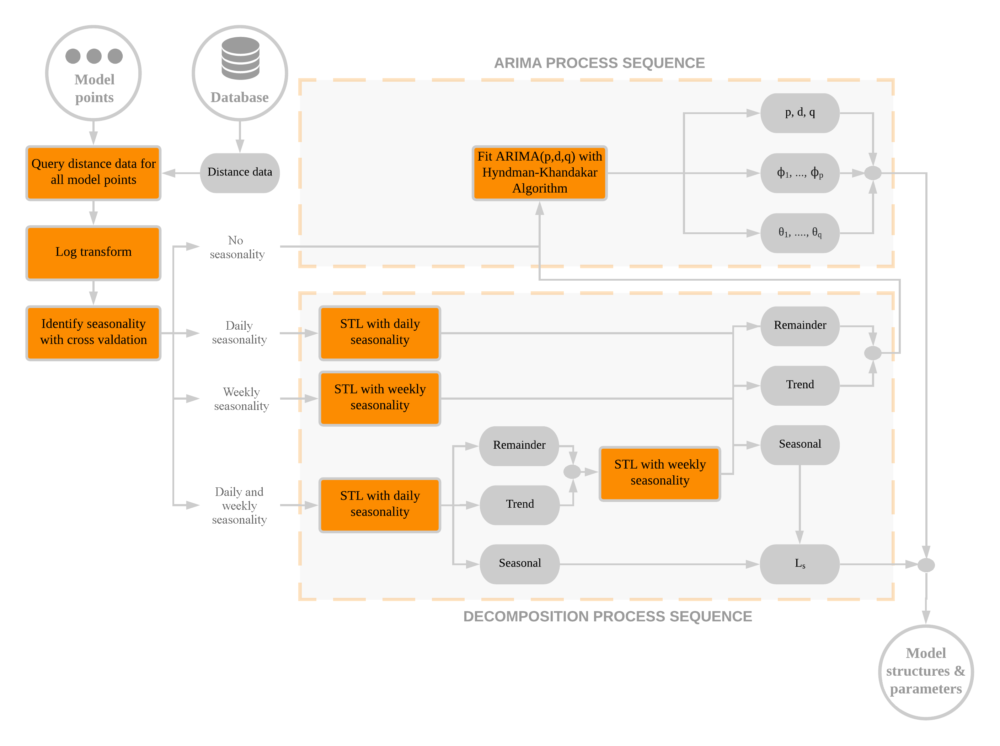

```{r setup, include=FALSE}
knitr::opts_chunk$set(echo = FALSE)
knitr::opts_chunk$set(out.width = "\\textwidth")
```

This chapter describes the methodology of DBAFS. It builds on the theory discussed in Chapter 2, and is structured as follows. In the first section, a general overview of the complete forecasting system is given. Section two presents the software that underlies DBAFS. The third, fourth and fifth section discusses the inputs to the system, including the computation that are done on the database server of the dockless bike sharing system. Subsequently, section six, seven and eight cover the detailed methodologies of all the distinct components of the system architecture seperately. Finally, in the last section, all the parameters of the system that need to be defined, are listed and discussed.

# 3.1 Overall design
The goal of DBAFS is to forecast the distance to the nearest available bike for a given location and a given timestamp in the future. It is meant to be used by both the operators and users of a dockless bike sharing system, which from now on are refered to as *users* of DBAFS. A forecast is made every time a user requests one. In intensively used bike sharing sytems, this can mean that several hundreds of forecasts are required every day, all based on different historical datasets. All these datasets usually consist of a time series with a high temporal resolution. Although the data may be complex, it would be inconvenient for the users if forecasts take a lot of time or need manual interventions. Taking into consideration the above-mentioned challenges, DBAFS should be a *fast* and *automated* process that still produces as accurate forecasts as possible.

The most time consuming part of the system is the selection of an appropriate model and the estimation of its parameters. If this had to be done at every forecast request seperately, forecasts would take too much time. Therefore, in DBAFS, forecasting models are build only once in a while at a limited number of locations. Each individual forecast will inherit the structure and parameters of one of those pre-build models, rather than building a completely new model on its own.

The approach of building models only at a limited number of locations, involves the selection of those locations. In DBAFS, this is done by dividing the system area of the dockless bike sharing system into spatially contiguous clusters, where each cluster contains the areas that show similar weekly patterns in the historical data. Then, each cluster is represented by a single *model point*, which is a geographical location where a model is build. An individual forecast takes the model structure and paramaters of the model point that is in the same cluster as the location of the forecast.

The architecture of DBAFS builds on two main assumptions. Firstly, it is assumed that the processes that generate the historical data at each location in a cluster are similar enough to be described by the same model. Secondly, it is assumed that these processes do not change radically over a short time period, such that a model fitted to a set of historical data, can still adequately describe new data coming from a location in the same cluster. Of course, these assumptions will not always be completely valid, but are made to obtain a reasonable compromise between fast and accurate forecasts.

The clustering, model building and forecasting processes can be seen as three distinct processing loops, that together make up DBAFS. The forecast loop runs every time a user makes a forecast request. The model loop only runs every $n_{m}$ weeks, and the cluster loop every $n_{c}$ weeks. The cluster, model and forecast loops are all completely automated and do not require any manual interventions. The overall design of DBAFS as described above is summarized in Figure 3.1. The inputs of the system, i.e. the system area, database and forecast request, are covered in section 3.3, 3.4 and 3.5, respectively, while section 3.6, 3.7 and 3.8 describe the detailed designs of the three processing loops.

```{r overalldesign}
knitr::include_graphics('Figures/Workflow.png')
```

# 3.2 Software
The underlying code of DBAFS (see Appendix A) is written in the R programming languague [@rlanguage]. However, Structured Query Language (SQL) statements are nested within the R code to retrieve data from a PostgreSQL database [@postgres], and to run some of the heavier data pre-processing computations on the database server. These computations are discussed in section 3.4.

On top of functions that are included in R by default, DBAFS uses of several extentions, listed below.

* The `ClustGeo` package, for spatially constrained clustering [@clustgeo].
* The `clValid` package, for calculating the Dunn Index [@clValid].
* The `forecast` package, for building forecasting models, decomposing time series, and forecasting time series [@forecast].
* The `lubridate` package, for processing dates and timestamps [@lubridate].
* The `RPostgreSQL` package, for connecting to a PostgreSQL database and running SQL code on the database server [@RPostgreSQL].
* The `sf` package, for processing spatial data [@sf].
* The `tsibble` package, for pre-processing time series datasets [@tsibble].

# 3.3 System area
Each dockless bike sharing system has a system area, in which the bikes can be used. Usually, leaving a bike outside of the system area, will result in a fine. DBAFS produces forecasts only inside the system area, and therefore, the geographical outline of this area needs to be provided. DBAFS accepts all filetypes that can be read with a driver supported by the `st_read` function in the `sf` package, given that the included feature is either a polygon or multipolygon. The accepted filetypes include, among others, ESRI shapefiles, GeoPackage files and GeoJSON files. It is also possible to retrieve the feature from a PostgreSQL database. A list of all the supported drivers is given in Appendix B.

# 3.4 Database
In a dockless bike sharing system, each bike is equipped with a Global Positioning System (GPS). Every $i_{d}$ minutes, the geographical locations of all bikes are saved into a database, together with the corresponding timestamp. The locations of the bikes that are not in use at the current time, and thus available, are usually visible to the users of the system in a mobile application, and stored seperately from the data regarding bikes that are in use.

The geographical location of a bike is spatial data, and should be stored as such. An advanced and open source database management system for spatial data is PostgreSQL in combination with the PostGIS extension. DBAFS requires the data to be stored in such a database, and to have a sub-daily temporal resolution. Each feature represents the location of an available bike at a certain timestamp and should at least have the following fields.

* A timestamp of data type `timestamp with time zone`.
* A geographical location of data type `geometry(Point)`.
* A unique ID of the bike to which the feature belongs.

Data are pre-processed on the database server, and only the data that are needed, are loaded into memory. In DBAFS, this pre-processing step involves two different procedures. The first one leads to data that contain information about the distance to the nearest bike for several timestamps in the past, and is discussed in the next sub-section, while the latter produces a dataset with all the bicycle pick-ups in the database, and is discussed in section 3.3.2.

## 3.4.1 Distance data
For a given location, the distance from that location to the nearest available bike is calculated for each timestamp $t \in T$, where $T$ is a regulary spaced time interval containing timestamps within the timespan of the historical data. The temporal resolution of $T$ equals $i_{s}$ minutes, where $i_{s} \geq i_{d}$. The nearest available bike is found by a nearest neighbor searching process that uses spatial indices on the geometries. In practice, this means that it is not needed to first compute the distances to all available bikes, which would slow down the process vastly. If no bike can be found, for example due to a server error at that timestamp,  or the unlikely event that there are no bikes available anywhere in the system, the corresponding feature will be inserted in the data, with a non-available distance value, $NA$. That is, after pre-processing, the resulting time series will always be regular, with all timestamps $t \in T$ present. This also means that when data are queried for several locations at the same times, the resulting time series will always have the same length.

The calculated distances are great-circle distances assuming a spherical earth a radius equal to the mean radius of the WGS84 ellipsoid, as showed in Equation 3.1.

$$
L_{AB} = \frac{(2a+b)}{3} \times
\frac{\pi}{180} \times
arccos(sin\phi_{A}sin\phi_{B}+cos\phi_{A}cos\phi_{B}cos\Delta\lambda)
$$

Where $L_{AB}$ is the great-circle distance between point $A$ and point $B$ in meters, $\phi_{A}$ and $\phi_{B}$ are the latitudes of respectively point $A$ and $B$ in degrees on the WGS84 ellipsoid, and $\Delta\lambda$ is the difference in longitude between the two points, i.e. $\lambda_{B}-\lambda_{A}$, in degrees on the WGS84 ellipsoid. Furthermore, $a$ is the equatorial radius of the WGS84 ellipsoid in meters, which is defined to be $6378137$, and $b$ is the polar radius of the WGS84 ellipsoid in meters, which is defined to be $6378137 \times (1 - 298.257 223 563^{-1}) = 6 356 752.3142$ [@iliffe2008].

The sphere is chosen since calculating distances on the ellipsoid itself slows down computations, and, on the geographical scale of a dockless bike sharing system, has an accuracy gain that can be neglected. Working with the shortest distance over the street network might in most cases be more approriate, but at the same time involves much more complex computations, especially when either the given location or the locations of the bikes are not exactly on the network lines.

The output of this pre-processing operation is a time series with $T$ features and a temporal resolution of $i_{s}$, belonging to one single location in the system area of the dockless bike sharing system. Each feature contains a timestamp and the great-circle distance from the given location to the nearest available bike in meters. Such data are refered to in this thesis as *distance data*. 

## 3.4.2 Usage data
A pick-up is the moment that a user of the dockless bike sharing system unlocks a bike to make a trip. For the historical database containing the locations of the available bikes, this means that the bike that is picked-up will be present in the data at the last timestamp before the pick-up, but missing at the first timestamp after the pick-up. In DBAFS, this is used to retrieve all the pick-ups from the database. Historical data with the highest possible temporal resolution, i.e. $i_{d}$ minutes, are queried for one single bike ID. Then, all timestamps that are missing, are added to the data, but without an available location. If feature $j$ has an available location, but feature $j+1$ has not, $j$ is considered a pick-up. This procedure is repeated for all individual bikes.

The output of this pre-processing operation is a data frame with all the features in the database that are considered pick-ups. Each feature has at least a timestamp, a geographical location and a bike ID. The number of pick-ups in an area represents the usage intensity of the bike sharing system. Such data are therefore refered to in this thesis as *usage data*.

Obviously, the procedure described in this sub-section has some deficiencies. The start of a GPS failure is falsely considered to be a pick-up, just as the removal of a bike by the system operator, for redistribution or maintenance purposes. Specific information about redistribution patterns can be added, but will in many cases be inavailable, and even if available, those patterns may be too irregular to implement adequately in the workflow. However, in DBAFS, the usage data are only used to define the location of the model point in a cluster, and not to analyze usage patterns into detail. Therefore, fully accurate data are not indispensable for this purpose, and the current procedure is sufficient.

# 3.5 Forecast request
A forecast request is made by a user. DBAFS assumes such a request to be composed of the geographical coordinates of the location at which the forecast should be made. The coordinates can be expressed in any coordinate reference system that is included in the PROJ library [@proj]. The timestamp can be expressed in any time zone that is included in the Time Zone database [@tz].

# 3.6 Cluster loop
The main purpose of the cluster loop is to find suitable locations for the model points. The loop starts by laying a grid with square cells of $p \times p$ meters over the system area of the dockless bike sharing system, such that each location in the system area is part of one of those grid cells. Then, the geographical coordinates of the centroids of the grid cells are calculated, and $m_{c}$ weeks of distance data are queried for each of those centroids. 

The result of this query operation is a set of $n$ time series, where $n$ is the number of cells in the overlaying grid. To reduce the dimensionality of the clustering task, each of those time series is simplified by averaging its values per hour of the week. This is followed by a min-max normalization, such that time series that show the same patterns over time, but with different means, will be considered similar. The normalized values are calculated with Equation 3.2.

$$ \hat{y_{t}} = \frac{y_{t} - y_{min}}{y_{max} - y_{min}} $$

Where $\hat{y_{t}}$ is the normalized value of $y_{t}$, $y_{min}$ is the minimum value in the time series, and $y_{max}$ is the maximum value in the time series. By definition, $0 \leq \hat{y_{t}} \leq 1$.

For all possible combinations of the $n$ averaged, normalized time series, a dissimilarity value is calculated based on the Euclidean distance between the two series, as defined in Equation 2.x. Since all time series have the same length, and observations at the same timestamps, the Euclidean approach is appropriate, and for the sake of simplicity, chosen over dynamic time warping. Furthermore, since out-of-phase similarities are ignored, areas where similar peaks and valleys in the data occur at different times of the week, will be grouped into different clusters, which gives a better representation of the spatio-temporal dynamics of the bike sharing system.

All Euclidean dissimilarity values are stored together in a $n \times n$ matrix and form the time series dissimilarity matrix $A$. At the same time, a spatial dissimilarity matrix $B$ is created. This matrix is equal to $1-C$, where $C$ is the adjacency matrix of the $n$ grid cells. That is, $B$ is a $n \times n$ matrix in which $b_{i,j} = 0$ when grid cells $i$ and $j$ are neighbors, and $b_{i,j} = 1$ otherwise.

$A$ and $B$ are used as the dissimilarity matrices of respectively the feature space and the constraint space in a spatially constrained hierarchical clustering procedure, which was introduced in section 2.5.3. Before the final clustering procedure can start, the number of clusters $k$ and the value of the mixing parameter $\alpha$ need to be set. DBAFS does this based on the approach proposed by @clustgeo, which was discussed in section 2.5.3, but replaces the manual interpretation of plots by a fully automated method, as described below.

At first, only the dissimilarity values in the feature space are clustered, i.e. a spatially constrained hierarchical clustering with $\alpha = 0$ is performed, which results in a sequence of partitions {$\Lambda_{k}$}. For each $k \in K$, where $K$ is a finite set of strictly positive integers, the Dunn Index $V(\Lambda_{k})$ of a specific partition $\Lambda_{k}$ is calculated with Equation 2.x. Then, the value of $k$ that maximizes $V(\Lambda_{k})$ is chosen as the optimal value of $k$, and is refered to as $k^{*}$.

Secondly, for each $\omega \in \Omega$, where $\Omega =$ {$0, 0.1, 0.2, ..., 1$}, a spatially constrained hierarchical clustering with $k = k^{*}$ and $\alpha = \omega$ is performed, which results in a set of partitions {$\Lambda_{\omega}$}, of the same length as $\Omega$. For each partition $\Lambda_{\omega}$, the sum $\sum I_{f}(C_{i}^{\omega})$ and the sum $\sum I_{c}(C_{i}^{\omega})$ are calculated, where $C_{i}^{\omega}$ are the clusters in $\Lambda_{\omega}$, $I_{f}$ is the information criterion regarding the feature data (i.e. the first part of Equation 2.x) and $I_{c}$ is the information criterion regarding the constraint data (i.e. the second part of Equation 2.x). Then, the value of $\omega$ that maximizes $\sum I_{c}(C_{i}^{\omega})$, given that $\big((\sum I_{f}(C_{i}^{\omega}) / \sum I_{f}(C_{i}^{0})\big) \geq 0.9$, is chosen as the optimal value of $\alpha$, and is refered to as $\alpha^{*}$.

With $A$, $B$, $k^{*}$ and $\alpha^{*}$ set, the final spatially constrained hierarchical clustering is performed. The output of this procedure is a single partition, in which all time series are grouped into a cluster. Since each time series uniquely corresponds to a grid cell centroid, it is now known to which cluster each grid cell and its centroid belongs.

Before the locations for the model points are chosen, usage data is queried from the database, and the total number of pick-ups is calculated for each grid cell. This number is assigned as a variable to the corresponding grid cell centroids. Then, for each cluster, the arithmetic means of the coordinates of all grid cell centroids in that cluster, are calculated, weighted by the number of pick-ups. Equation 3.3 shows the calculation of the weighted average latitude of a cluster, while Equation 3.4 shows the calculation of the weighted average longitude of a cluster.

$$ \phi^{*} = \frac{\sum_{i=1}^{m} \phi_{i} \times p_{i}}{\sum_{i=1}^{m} p_{i}} $$
$$ \lambda^{*} = \frac{\sum_{i=1}^{m} \lambda_{i} \times p_{i}}{\sum_{i=1}^{m} p_{i}} $$

Where $\phi^{*}$ and $\lambda^{*}$ are respectively the weighted average latitude and the weighted average longitude of the cluster, $\phi_i$ and $\lambda_{i}$ are respectively the latitude and longitude of the $i_{th}$ grid cell centroid in the cluster, $p_{i}$ is the number of pick-ups in the $i_{th}$ grid cell in the cluster, and $m$ is the total number of grid cells in the cluster. 

The combination {$\phi^{*}, \lambda^{*}$} forms the coordinate pair of the weighted centroid of the cluster. Because of the spatial constraint in the hierarchical clustering procedure, the clusters should be more or less contiguous, and the weighted centroid will effectively be located inside its corresponding cluster. This weighted centroid is then chosen to be the model point of that cluster. In this way, a model point is a cluster centroid which is dragged towards the areas where the usage intensity of the bike sharing system is higher, and where accurate forecasts are thus more important. The model points of all clusters are send to the model loop. Finally, for each cluster, grid cells are first dissolved, and then clipped by the system area, to form one geographic outline of that cluster. The geographic outlines of all clusters are send to the forecast loop. The complete methodology of the cluster loop as described above is summarized in Figure 3.2.

```{r clusterloop}
knitr::include_graphics('Figures/Clusterloop.png')
```

# 3.7 Model loop
The main purpose of the model loop is to fit time series models to the historical data of a limited set of geographical locations. These locations are called the *model points*, and result from a previous pass through the cluster loop. For each model point, $m_{m}$ weeks of distance data are queried. All data are log-transformed, to stabalize the variance, and to make sure that, when using the models for forecasting, the forecasted distances will always be larger than zero. 

If the data are seasonal, they will pass through the decomposition process sequence. There, they will be decomposed into a trend, seasonal and remainder component with STL, as introduced in section 2.3.3. Single seasonal data, with either a daily or a weekly seasonal pattern, will be decomposed once. Multiple seasonal data, that show both a daily and a weekly seasonal pattern, will first be decomposed assuming that only daily seasonality is present, after which the trend and remainder component are added together, and decomposed again, now assuming weekly seasonality. Hence, such data are eventually decomposed in a trend, remainder and two seasonal components. Since STL is performed on the log transformation of the original data, this indirectly implies that the orginal data are decomposed in a multiplicative way, as explained at the end of section 2.3.3. 

STL requirers a set of parameters to be defined in advance. For most of them, there exist clear guidelines for the choice of their values, indited by @cleveland1990. Below, all STL parameters are listed, including their quantification as used in DBAFS.

* $n_{p}$, the number of observations per seasonal cycle. When decomposing assuming daily seasonality, $n_{p} = 60 \times 24 / i_{s}$, and when assuming weekly seasonality, $n_{p} = 60 \times 24 \times 7 / i_{s}$.
* $n_{i}$, the number of passes through the inner loop within one pass through the outer loop. It should be chosen large enough such that the updating of the seasonal and trend components converges. @cleveland1990 show that this convergence happens very fast, and that, inside a pass through the outer loop, only one pass through the inner loop is already sufficient. Hence, in DBAFS, $n_{i} = 1$.
* $n_{o}$, the number of passes through the outer loop. To have near certainty of convergence, @cleveland1990 recommend ten passes through the outer loop. In R, to be extra safe, the default is set to fifteen passes. This will not be changed in DBAFS, hence $n_{o} = 15$.
* $n_{s}$, the seasonal smoothing parameter. It should be chosen large enough to avoid overfitting, but small enough to allow slight variations over time. The choice of $n_{s}$ is the only one where @cleveland1990 propose a manual approach, that involves a visual interpretation of the time series plot. For an automated process that decomposes several time series, this is problematic. @hyndman2018fpp, however, argue that a value of thirteen usually gives a good balance between overfitting and allowing slight variations. In DBAFS, their recommendation is used. Hence, $n_{s} = 13$.
* $n_{l}$, the low-pass filter smoothing parameter. @cleveland1990 show that $n_{l}$ always can be set equal to the least odd integer greater than or equal to $n_{p}$, which is done in DBAFS as well. 
* $n_{t}$, the trend smoothing parameter. It should be chosen large enough such that seasonal variation does not end up in the trend component, but small enough such that low-frequency effects do not end up in the remainder component. To achieve this goals, @cleveland1990 show that $n_{t}$ should be chosen to be the smallest odd integer that satisfies the inequality $n_{t} \geq 1.5n_{p} / (1-1.5n_{s}^{-1})$. In DBAFS, this is done as well.

Once the data are decomposed in a trend component, a remainder component and one or two seasonal components, the trend and remainder are added together, and send to the ARIMA process sequence. This part of the data can be seen as the log-transformed, deseasonalized orignal data, and should not contain seasonal patterns anymore. Data that were orginally already non-seasonal, skip the decomposition process sequence completely, and are send to the ARIMA process sequence directly after the log transformation. Both types are from now on refered to as the *non-seasonal data*.

In the ARIMA process sequence, an ARIMA($p$, $d$, $q$) model is fitted to the non-seasonal data, by applying the Hyndman-Khandakar algorithm, as described in section 2.4.2.2. In R, the Hyndman-Khandakar algorithm is implemented in the `auto.arima` function from the `forecast` package, with the extra restriction that the order of differencing $d$ is not allowed to be larger than two. It also allows missing values, by handling them exactly. This is an important characteristic, since it means that models will be fitted even if some observations are missing due to server errors.

To determine if the data of a model point should pass through the decomposition process sequence, and if yes, how many seasonal components should be substracted, it is necessary to first identify the seasonal patterns in the data. This is done with a variation on what @hyndman2018fpp refer to as *time series cross-validation*, and works as follows. Four different seasonality options are considered:

* No seasonality
* Daily seasonality
* Weekly seasonality
* Daily and weekly seasonality

Then, the first four of the $n_{w}$ weeks of data are selected and log-transformed. Four different models are fitted to these data, each assuming a different seasonality option. That is, when the option of no seasonality is considered, the data are directly inputted into the ARIMA process sequence. When one of the other options is considered, the data first pass through the decomposition process sequence, and then, the deseasonalized data are inputted into the ARIMA process sequence. Subsequently, each day in the two weeks directly after the 'model building weeks', is forecasted seperately. For the first day, this simply means that the non-seasonal data on which the ARIMA($p$,$d$,$q$) model is build, is forecasted $60 \times 24 / i_{s}$ time lags ahead. If present, the seasonal component is forecasted in a naïve way, and added to each result. For the second day, however, one extra day of data is added, and the same ARIMA($p$,$d$,$q$) model is used to forecast the non-seasonal part of this extended data $60 \times 24 / i_{s}$ time lags ahead, and if present, the naïve seasonal forecasts are added to the results. This process repeats for all the days, each time using one extra day of data.

Once all days in these two 'forecasting weeks' are forecasted, the four weeks of data on which the models were build, are now extended by two weeks of new data. On this six-week dataset, new models are build for each of the four seasonality options, and again, each day in the next two weeks is forecasted seperately. This shifting of the model building period keeps repeating, until there are no more weeks left to forecast. Then, for each of the seasonality options, the total RMSE of all forecasts is calculated. The option with the lowest RMSE, is the identified seasonal pattern of the data. The cross-validation process is summarized in Figure 3.3.

After the log-transformation, seasonality detection, possible decomposition, and model building, the following output is obtained. All model points have an ARIMA($p$,$d$,$q$) model that describes the non-seasonal part of their data. Additionally, the length of the seasonal period in their data is known. This can either be a single non-zero integer, in the case of only a daily or weekly seasonality, a vector of two non-zero integers, in the case of both a daily and a weekly seasonality, or zero, in the case of no seasonality. The chosen values $p$, $d$ and $q$ of the ARIMA model, the estimated parameter values $\hat\phi_{1},...,\hat\phi_{p}$ and $\hat\theta_{1},...,\hat\theta_{q}$ of the ARIMA model, and the length of the seasonal period, are all send to the forecast loop. The complete methodology of the cluster loop as described above is summarized in Figure 3.4. 

```{r modelloop}

```


# 3.8 Forecast loop

# 3.9 Parameters
$n_{m}$ should be chosen such that new models are build when the patterns in the historical data have changed considerably. Based on real-world data, which are presented later in this thesis, it is recommended to update the models every month. That is, $n_{m}$ = 4.

$n_{c}$ should be chosen such that new clusters are defined when the spatial distribution of the weekly patterns in the historical data has changed considerably. The real-world data used in this thesis were not long enough to define a recommended value for $n_{c}$, but in most cases, it will be much larger than $n_{m}$.

\newpage

# References
