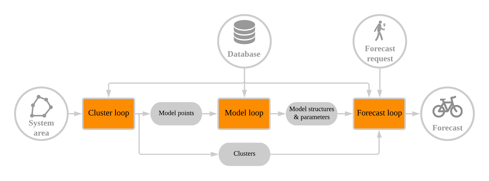
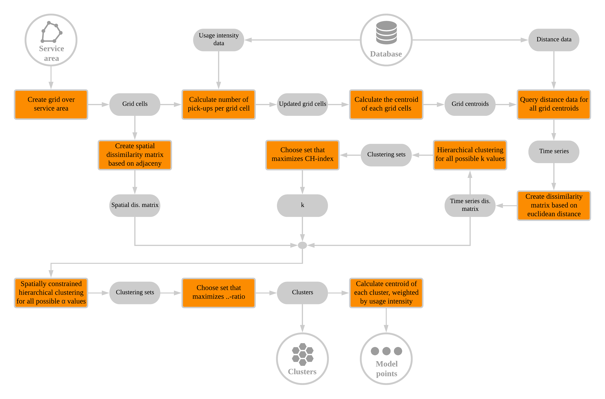

```{r setup, include=FALSE}
knitr::opts_chunk$set(echo = FALSE)
knitr::opts_chunk$set(out.width = "\\textwidth")
```

This chapter describes the methodology of DBAFS. It builds on the theory discussed in Chapter 2, and is structured as follows. In the first section, a general overview of the complete forecasting system is given. Section two presents the software that underlies DBAFS, while in the third section, the computations on the database server are discussed. Section three, four and five cover the detailed methodologies of all the distinct components of the system architecture seperately. Finally, in the last section, all the parameters of the system that need to be defined, are listed and discussed.

# 3.1 Overall design
The goal of DBAFS is to forecast the distance to the nearest available bike for a given location and a given timestamp in the future. It is meant to be used by both the operators and users of a dockless bike sharing system, which from now on are refered to as *users* of DBAFS. A forecast is made every time a user requests one. In intensively used bike sharing sytems, this can mean that several hundreds of forecasts are required every day, all based on different historical datasets. All these datasets usually consist of a time series with a high temporal resolution. Although the data may be complex, it would be inconvenient for the users if forecasts take a lot of time or need manual interventions. Taking into consideration the above-mentioned challenges, DBAFS should be a *fast* and *automated* process that still produces as accurate forecasts as possible.

The most time consuming part of the system is the selection of an appropriate model and the estimation of its parameters. If this had to be done at every forecast request seperately, forecasts would take too much time. Therefore, in DBAFS, forecasting models are build only once in a while at a limited number of locations. Each individual forecast will inherit the structure and parameters of one of those pre-build models, rather than building a completely new model on its own.

The approach of building models only at a limited number of locations, involves the selection of those locations. In DBAFS, this is done by dividing the service area of the dockless bike sharing system into spatially contiguous clusters, where each cluster contains the areas that show similar weekly patterns in the historical data. Then, each cluster is represented by a single *model point*, which is a location where a model is build. An individual forecast takes the model structure and paramaters of the model point that is in the same cluster as the location of the forecast.

The clustering, model building process and forecasting processes can be seen as three distinct processing loops, that together make up DBAFS. The forecast loop runs every time a user makes a forecast request. The model loop only runs every $n_{m}$ weeks, and the cluster loop every $n_{c}$ weeks. The cluster, model and forecast loops are all completely automated and do not require any manual interventions. The overall design of DBAFS is summarized graphically in Figure 3.1. The detailed methodologies of the three loops are discussed in section 3.4, 3.5 and 3.6, respectively.

```{r overalldesign}

```

# 3.2 Software
The underlying code of DBAFS is written in the R programming languague [@rlanguage]. However, Structured Query Language (SQL) statements are nested within the R code to retrieve data from a PostgreSQL database [@postgres], and to run some of the heavier data pre-processing computations on the database server. These computations are discussed in the next section.

On top of functions that are included in R by default, DBAFS makes use of several extentions, as listed below.

* The `ClustGeo` package, for spatially constrained clustering [@clustgeo].
* The `forecast` package, for building forecasting models, decomposing time series, and forecasting time series [@forecast].
* The `lubridate` package, for processing dates and timestamps [@lubridate].
* The `RPostgreSQL` package, for connecting to a PostgreSQL database and running SQL code on the database server [@RPostgreSQL].
* The `sf` package, for processing spatial data [@sf].
* The `tsibble` package, for pre-processing time series datasets [@tsibble].

# 3.3 Database
In a dockless bike sharing system, each bike is equipped with a Global Positioning System (GPS). Every $i_{d}$ minutes, the geographical locations of all bikes are saved into a database, together with the corresponding timestamp. The locations of the bikes that are not in use at the current time, and thus available, are usually visible to the users of the system in a mobile application, and stored seperately from the data regarding bikes that are in use.

The geographical location of a bike is spatial data, and should be stored as such. An advanced and open source database management system for spatial data is PostgreSQL in combination with the PostGIS extension. DBAFS requires the data to be stored in such a database. Each feature represents the location of an available bike at a certain timestamp and should at least have the following fields.

* A timestamp of data type `timestamp with time zone`.
* A geographical location of data type `geometry(Point)`.
* A unique ID of the bike to which the feature belongs.

Data are pre-processed on the database server, and only the data that are needed, are loaded into memory. In DBAFS, this pre-processing step involves two different procedures. The first one leads to data that contain information about the distance to the nearest bike for several timestamps in the past, and is discussed in the next sub-section, while the latter produces a dataset with all the bicycle pick-ups in the database, and is discussed in section 3.3.2.

## 3.3.1 Distance data
For a given location, the distance from that location to the nearest available bike is calculated for each timestamp $t \in T$, where $T$ is a regulary spaced time interval containing timestamps within the timespan of the historical data. The temporal resolution of $T$ equals $i_{s}$ minutes, where $i_{s} \geq i_{d}$. The nearest available bike is found by a nearest neighbor searching process that uses spatial indices on the geometries. In practice, this means that it is not needed to first compute the distances to all available bikes, which would slow down the process vastly. If no bike can be found, for example due to a server shutdown at that timestamp, the corresponding feature will be inserted in the data, with a non-available distance value, $NA$.

The calculated distances are great-circle distances assuming a spherical earth a radius equal to the mean radius of the WGS84 ellipsoid, as showed in Equation 3.1.

$$
L_{AB} = \frac{(2a+b)}{3} \times
\frac{\pi}{180} \times
arccos(sin\phi_{A}sin\phi_{B}+cos\phi_{A}cos\phi_{B}cos\Delta\lambda)
$$

Where $L_{AB}$ is the great-circle distance between point $A$ and point $B$ in meters, $\phi_{A}$ and $\phi_{B}$ are the latitudes of respectively point $A$ and $B$ in degrees on the WGS84 ellipsoid, and $\Delta\lambda$ is the difference in longitude between the two points, i.e. $\lambda_{B}-\lambda_{A}$, in degrees on the WGS84 ellipsoid. Furthermore, $a$ is the equatorial radius of the WGS84 ellipsoid in meters, which is defined to be $6378137$, and $b$ is the polar radius of the WGS84 ellipsoid in meters, which is defined to be $6378137 \times (1 - 298.257 223 563^{-1}) = 6 356 752.3142$ [@iliffe2008].

The sphere is chosen since calculating distances on the ellipsoid itself slows down computations, and, on the geographical scale of a dockless bike sharing system, has an accuracy gain that can be neglected. Working with the shortest distance over the street network might in most cases be more approriate, but at the same time involves much more complex computations, especially when either the given location or the locations of the bikes are not exactly on the network lines.

The output of this pre-processing operation is a time series with $T$ features and a temporal resolution of $i_{s}$, belonging to one single location in the service area of the dockless bike sharing system. Each feature contains a timestamp and the great-circle distance from the given location to the nearest available bike in meters. Such data are refered to in this thesis as *distance data*. 

## 3.3.2 Usage data
A pick-up is the moment that a user of the dockless bike sharing system unlocks a bike to make a trip. For the historical database containing the locations of the available bikes, this means that the bike that is picked-up will be present in the data at the last timestamp before the pick-up, but missing at the first timestamp after the pick-up. In DBAFS, this is used to retrieve all the pick-ups from the database. Historical data with the highest possible temporal resolution, i.e. $i_{d}$ minutes, are queried for one single bike ID. Then, all timestamps that are missing, are added to the data, but without an available location. If feature $j$ has an available location, but feature $j+1$ has not, $j$ is considered a pick-up. This procedure is repeated for all individual bikes.

The output of this pre-processing operation is a data frame with all the features in the database that are considered pick-ups. Each feature has at least a timestamp, a geographical location and a bike ID. The number of pick-ups in an area represents the usage intensity of the bike sharing system. Such data are therefore refered to in this thesis as *usage data*.

Obviously, the procedure described in this sub-section has some deficiencies. The start of a GPS failure is falsely considered to be a pick-up, just as the removal of a bike by the system operator, for redistribution or maintenance purposes. Specific information about redistribution patterns can be added, but will in many cases be inavailable, and even if available, those patterns may be too irregular to implement adequately in the workflow. However, in DBAFS, the usage data are only used to define the location of the model point in a cluster, and not to analyze usage patterns into detail. Therefore, fully accurate data are not indispensable for this purpose, and the current procedure is sufficient.

# 3.4 Cluster loop
The main purpose of the cluster loop is to find suitable locations for the model points. The loop starts by laying a grid with square cells of $p \times p$ meters over the service area of the dockless bike sharing system, such that each location in the service area is part of one of those grid cells. Then, the geographical coordinates of the centroids of the grid cells are calculated, and $m_{c}$ weeks of distance data are queried for each of those centroids. 

The result of this query operation is a set of $n$ time series, where $n$ is the number of cells in the overlaying grid. Each of those time series is simplified by averaging its values per hour of the week. This is followed by a min-max normalization, such that time series that show the same patterns over time, but with different means, will be considered similar. The normalized values are calculated with Equation 3.2.

$$ \hat{y_{t}} = \frac{y_{t} - y_{min}}{y_{max} - y_{min}} $$

Where $\hat{y_{t}}$ is the normalized value of $y_{t}$, $y_{min}$ is the minimum value in the time series, and $y_{max}$ is the maximum value in the time series. By definition, $0 \leq \hat{y_{t}} \leq 1$.

For all possible combinations of the $n$ averaged, normalized time series, a dissimilarity value is calculated based on the Euclidean distance between the two series, as defined in Equation 2.x. Euclidean distance is chosen over dynamic time warping, for the sake of simplicity. All dissimilarity values are stored together in a $n \times n$ matrix and form the time series dissimilarity matrix $A$. At the same time, a spatial dissimilarity matrix $B$ is created. This matrix is equal to $1-C$, where $C$ is the adjacency matrix of the $n$ grid cells. That is, $B$ is a $n \times n$ matrix in which $b_{i,j} = 0$ when grid cells $i$ and $j$ are neighbors, and $b_{i,j} = 1$ otherwise.

$A$ and $B$ are used as the dissimilarity matrices of respectively the feature space and the constraint space in a spatially constrained hierarchical clustering procedure, which was introduced in section 2.5.x. Before the final clustering procedure can start, the number of clusters $k$ and the value of the mixing parameter $\alpha$ need to be set. To do so, @clustgeo propose a manual approach that involves visual interpretations of several plots, but in this thesis, a fully automated approach is used instead.

Firstly, only the dissimilarity values in the feature space are clustered, i.e. a spatially constrained hierarchical clustering with $\alpha = 0$ is performed, and $k$ is chosen such that the CH-index of the resulting clusters, as defined in Equation 2.x, is minimized. Obviously, the CH-index is not calculated for all possible values of $k$, but only for those $k \in K$, where $K$ is a finite set of strictly positive integers. The optimal value of $k$ will be refered to as $k^{*}$.

Secondly, for each $\lambda \in \Lambda$, where $\Lambda =$ {$0, 0.1, 0.2, ..., 1$}, a spatially constrained hierarchical clustering with $k = k^{*}$ and $\alpha = \lambda$ is performed. Then, ..... The optimal value of $\alpha$ will be refered to as $\alpha^{*}$.

With $A$, $B$, $k^{*}$ and $\alpha^{*}$ set, the final spatially constrained hierarchical clustering is performed. The output of this procedure is a list of $n$ elements, each representing the cluster index of a particular grid cell. This cluster information is added as a variable to both the grid cell and the centroids of those grid cells. 

Before the locations for the model points are chosen, usage data is queried from the database, and the total number of pick-ups is calculated for each grid cell. This number is assigned as a variable to the corresponding grid cell centroids. Then, for each cluster, the arithmetic mean of the coordinates of all grid cell centroids in that cluster, is calculated, weighted by the number of pick-ups. Equation 3.3 shows the calculation of the weighted average latitude of a cluster, while Equation 3.4 shows the calculation of the weighted average longitude of a cluster.

$$ \phi^{*} = \frac{\sum_{i=1}^{m} \phi_{i} \times p_{i}}{\sum_{i=1}^{m} p_{i}} $$
$$ \lambda^{*} = \frac{\sum_{i=1}^{m} \lambda_{i} \times p_{i}}{\sum_{i=1}^{m} p_{i}} $$

Where $\phi^{*}$ and $\lambda^{*}$ are respectively the weighted average latitude and the weighted average longitude of the cluster, $\phi_i$ and $\lambda_{i}$ are respectively the latitude and longitude of the $i_{th}$ grid cell centroid in the cluster, $p_{i}$ is the number of pick-ups in the $i_{th}$ grid cell in the cluster, and $m$ is the total number of grid cells in the cluster. 

The combination {$\phi^{*}, \lambda^{*}$} forms the coordinate pair of the weighted centroid of the cluster. This weighted centroid is chosen to be the model point of that cluster. In this way, a model point is the centroid of a cluster, but dragged towards the areas where the usage intensity of the bike sharing system is higher, and where accurate forecasts are thus more important. The model points of all clusters are send to the model loop. Finally, for each cluster, grid cells are dissolved to form one geographic outline of that cluster. The geographic outlines of all clusters are send to the forecast loop. The complete methodology of the cluster loop is summarized graphically in Figure 3.2.

```{r clusterloop}

```

# 3.5 Model loop

# 3.6 Forecast loop

# 3.7 Parameters
$n_{m}$ should be chosen such that new models are build when the patterns in the historical data have changed considerably. Based on real-world data, which are presented later in this thesis, it is recommended to update the models every month. That is, $n_{m}$ = 4.

$n_{c}$ should be chosen such that new clusters are defined when the spatial distribution of the weekly patterns in the historical data has changed considerably. The real-world data used in this thesis were not long enough to define a recommended value for $n_{c}$, but in most cases, it will be much larger than $n_{m}$.
