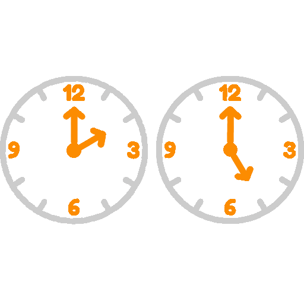
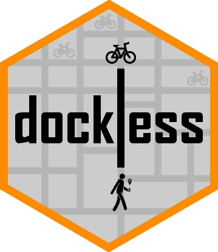

```{r setup, include=FALSE}
options(htmltools.dir.version = FALSE)
```

background-image: url('images/bike.png')
background-size: cover
class: center, center, inverse

# Towards more sustainable cities

---

background-image: url('images/bike2.png')
background-size: cover
class: center, center, inverse

# With dockless bike sharing

---

background-image: url('images/hexagon.png')
background-size: 80px
background-position: 90% 4%

# What do we need?
.center[
.pull-left[
### Good bike infrastructure
```{r, echo = FALSE, cache = TRUE, out.width='70%'}

```
]

.pull-right[
### A reliable system
```{r, echo = FALSE, cache = TRUE, out.width='70%'}

```
]
]

---

background-image: url('images/hexagon.png')
background-size: 80px
background-position: 90% 4%

# What does a reliable system mean?

.center[
.pull-left[
### Station based systems
```{r, echo = FALSE, cache = TRUE, out.width='70%'}
knitr::include_graphics("images/station.png")
```
]

.pull-right[
### Dockless systems
```{r, echo = FALSE, cache = TRUE, out.width='70%'}

```
]
]

---

background-image: url('images/hexagon.png')
background-size: 80px
background-position: 90% 4%

# How do forecasts help to make systems more reliable?

.center[
.pull-left[
### User perspective
```{r, echo = FALSE, cache = TRUE, out.width='70%'}
knitr::include_graphics("images/users.png")
```
]

.pull-right[
### Operator perspective
```{r, echo = FALSE, cache = TRUE, out.width='70%'}
knitr::include_graphics("images/operators.png")
```
]
]

---

background-image: url('images/hexagon.png')
background-size: 80px
background-position: 90% 4%
class: middle, center

# Aim:
# Create a generally applicable <span style = 'color:#fc8c01;'>methodology</span> to forecast bike availability in dockless bike sharing systems

---

background-image: url('images/hexagon.png')
background-size: 80px
background-position: 90% 4%

# Challenges

.center[
.pull-left[
### Station based systems
```{r, echo = FALSE, cache = TRUE, out.width='70%'}
knitr::include_graphics("images/station.png")
```
]

.pull-right[
### Dockless systems
```{r, echo = FALSE, cache = TRUE, out.width='70%'}

```
]
]

---

background-image: url('images/hexagon.png')
background-size: 80px
background-position: 90% 4%

# Challenges

.center[
.pull-left[
### Patterns over space
```{r, echo = FALSE, cache = TRUE, out.width='70%'}

```
]

.pull-right[
### Patterns over time
```{r, echo = FALSE, cache = TRUE, out.width='70%'}

```
]
]

---

background-image: url('images/hexagon.png')
background-size: 80px
background-position: 50% 35%
class: middle, center

# Methodology

---

background-image: url('images/hexagon.png')
background-size: 80px
background-position: 90% 4%

# What to forecast?

# For a given <span style = 'color:#fc8c01;'>location</span>, and a given <span style = 'color:#fc8c01;'>timestamp</span> in the future, forecast the expected <span style = 'color:#fc8c01;'>distance</span> to the nearest available bike

```{r, echo = FALSE, cache = TRUE}

```

---

background-image: url('images/hexagon.png')
background-size: 80px
background-position: 90% 4%

# Requirements

.center[
.col-one[
### Accurate
```{r, echo = FALSE, cache = TRUE, out.width='70%'}
knitr::include_graphics("images/accurate.png")
```
]

.col-two[
### Automated
```{r, echo = FALSE, cache = TRUE, out.width='70%'}
knitr::include_graphics("images/automated.png")
```
]

.col-three[
### Fast
```{r, echo = FALSE, cache = TRUE, out.width='70%'}
knitr::include_graphics("images/fast.png")
```
]
]

---

background-image: url('images/hexagon.png')
background-size: 80px
background-position: 90% 4%

# Overall design

```{r, echo = FALSE, cache = TRUE}
knitr::include_graphics("../figures/workflow.png")
```

---

background-image: url('images/hexagon.png')
background-size: 80px
background-position: 90% 4%

# Case study: San Francisco

```{r, echo = FALSE, message = FALSE, warning = FALSE, fig.width = 14}
require(leaflet)
require(sf)
require(jsonlite)

systemarea = readRDS('../data/systemarea.rds')
gridcells = readRDS('../data/gridcells.rds')

json = fromJSON(
  "https://sf.jumpbikes.com/opendata/free_bike_status.json",
  flatten = TRUE
)

locations = st_as_sf(json$data$bikes, coords = c('lon', 'lat'))

bikeicon = makeIcon("images/bikeicon.png", 20, 20)

leaflet() %>%
  addPolygons(
    data = systemarea,
    stroke = TRUE,
    color = 'black',
    opacity = 1,
    fill = TRUE,
    fillColor = '#cccccc',
    fillOpacity = 0.5
  ) %>%
  addMarkers(
    data = locations,
    icon = bikeicon
  ) %>%
  addPolygons(
    data = gridcells,
    stroke = FALSE,
    fill = FALSE
  ) %>%
  addProviderTiles(
    provider = providers$Esri.WorldGrayCanvas
  )
```

---

background-image: url('images/hexagon.png')
background-size: 80px
background-position: 90% 4%

# Train and test period

```{r, echo = FALSE, cache = TRUE}

```

---

background-image: url('images/hexagon.png')
background-size: 80px
background-position: 90% 4%

# Cluster loop

```{r, echo = FALSE, cache = TRUE}
knitr::include_graphics("../figures/workflow.png")
```

---

background-image: url('images/hexagon.png')
background-size: 80px
background-position: 90% 4%

# System area

```{r, echo = FALSE, message = FALSE, fig.width = 14}
require(leaflet)

leaflet() %>%
  addPolygons(
    data = systemarea,
    stroke = TRUE,
    color = '#fc8c01',
    opacity = 1,
    fill = TRUE,
    fillColor = '#cccccc',
    fillOpacity = 0.5
  ) %>%
  addPolygons(
    data = gridcells,
    stroke = FALSE,
    fill = FALSE
  ) %>%
  addProviderTiles(
    provider = providers$Esri.WorldGrayCanvas
  )
```

---

background-image: url('images/hexagon.png')
background-size: 80px
background-position: 90% 4%

# Overlaying grid

```{r, echo = FALSE, cache = TRUE, message = FALSE, fig.width = 14}
gridcentroids = readRDS('../data/gridcentroids.rds')

leaflet() %>%
  addPolygons(
    data = systemarea,
    stroke = TRUE,
    color = 'black',
    weight = 2,
    fill = FALSE,
    highlightOptions = highlightOptions(weight = 10)
  ) %>%
  addPolygons(
    data = gridcells,
    stroke = TRUE,
    color = '#fc8c01',
    weight = 2,
    opacity = 1,
    fill = TRUE,
    fillColor = '#cccccc',
    fillOpacity = 0.5
  ) %>%
  addCircles(
    data = gridcentroids,
    stroke = FALSE,
    fill = TRUE,
    fillColor = 'black',
    fillOpacity = 1
  ) %>%
  addProviderTiles(
    provider = providers$Esri.WorldGrayCanvas
  )

```

---

background-image: url('images/hexagon.png')
background-size: 80px
background-position: 90% 4%

# Spatially constrained hierarchical clustering

```{r, echo = FALSE, cache = TRUE, message = FALSE, fig.width = 14}
require(dockless)

clusters = readRDS('../data/clusters.rds')
clusters = clusters$outlines

pal = colorFactor(
  palette = dockless_colors(categorical = TRUE),
  domain = clusters$cluster
)

leaflet() %>%
  addPolygons(
    data = clusters,
    stroke = TRUE,
    color = 'black',
    weight = 2,
    fill = TRUE,
    fillColor = ~pal(cluster),
    fillOpacity = 0.8
  ) %>%
  addLegend(
    data = clusters,
    position = "bottomleft",
    colors = dockless_colors(categorical = TRUE)[1:4],
    labels = c('Bayview', 'Downtown', 'Residential', 'Presidio'),
    labFormat = labelFormat(),
    title = "Cluster",
    opacity = 1
  ) %>%
  addPolygons(
    data = gridcells,
    stroke = FALSE,
    fill = FALSE
  ) %>%
  addProviderTiles(
    provider = providers$Esri.WorldGrayCanvas
  )

```

---

background-image: url('images/hexagon.png')
background-size: 80px
background-position: 90% 4%

# Model points

```{r, echo = FALSE, cache = TRUE, message = FALSE, fig.width = 14}
modelpoints = readRDS('../data/modelpoints.rds')

pal = colorFactor(
  palette = dockless_colors(categorical = TRUE),
  domain = clusters$cluster
)

leaflet() %>%
  addPolygons(
    data = clusters,
    stroke = TRUE,
    color = 'black',
    weight = 2,
    fill = TRUE,
    fillColor = '#cccccc',
    fillOpacity = 0.5
  ) %>%
  addCircleMarkers(
    data = modelpoints,
    stroke = TRUE,
    color = 'black',
    fill = TRUE,
    fillColor = ~pal(cluster),
    fillOpacity = 0.8
  ) %>%
  addLegend(
    data = modelpoints,
    position = "bottomleft",
    colors = dockless_colors(categorical = TRUE)[1:4],
    labels = c('Bayview', 'Downtown', 'Residential', 'Presidio'),
    labFormat = labelFormat(),
    title = "Model point",
    opacity = 1
  ) %>%
  addPolygons(
    data = gridcells,
    stroke = FALSE,
    fill = FALSE
  ) %>%
  addProviderTiles(
    provider = providers$Esri.WorldGrayCanvas
  )

```

---

background-image: url('images/hexagon.png')
background-size: 80px
background-position: 90% 4%

# Model loop

```{r, echo = FALSE, cache = TRUE}
knitr::include_graphics("../figures/workflow.png")
```

---

background-image: url('images/timeplots.png')
background-size: contain

---

background-image: url('images/stlplot_model2.png')
background-size: contain

---

background-image: url('images/hexagon.png')
background-size: 80px
background-position: 90% 4%

# The models

```{r, echo = FALSE, cache = TRUE, message = FALSE, out.width='100%'}
require(kableExtra)

models = data.frame(
  SEASONALITY = c('None', 'Daily', 'Daily', 'None'),
  STOCHASTIC = c('ARIMA(3, 1, 1)', 'ARIMA(2, 1, 1)', 'ARIMA(1, 1, 1)', 'ARIMA(1, 1, 3)')
)

rownames(models) = c('Bayview cluster', 'Downtown cluster', 'Residential cluster', 'Presidio cluster')
colnames(models) = c('Seasonality', 'Stochastic model')

knitr::kable(
  models,
  format = 'html',
  caption = 'Model structures'
) %>%
  kable_styling() %>%
  row_spec(0, color = 'black', bold = FALSE, background = '#fc8c01') %>%
  column_spec(1:3, width = '8cm')

```

---

background-image: url('images/hexagon.png')
background-size: 80px
background-position: 90% 4%

# Forecast loop

```{r, echo = FALSE, cache = TRUE, cache = TRUE}
knitr::include_graphics("../figures/workflow.png")
```

---

background-image: url('images/hexagon.png')
background-size: 80px
background-position: 90% 4%

# Simulating forecast requests

.center[
.col-one[
### More requests at locations where the usage is higher
```{r, echo = FALSE, cache = TRUE, cache = TRUE, out.width='70%'}

```
]

.col-two[
### More request at timestamps when the usage is higher
```{r, echo = FALSE, cache = TRUE, cache = TRUE, out.width='70%'}

```
]

.col-three[
### Location and timestamp are always a combination!
```{r, echo = FALSE, cache = TRUE, cache = TRUE, out.width='70%'}

```
]
]

---

background-image: url('images/hexagon.png')
background-size: 80px
background-position: 90% 4%

# Test points

```{r, echo = FALSE, cache = TRUE, cache = TRUE, message = FALSE, fig.width = 14}
testpoints = readRDS('../data/testpoints.rds')

leaflet() %>%
  addPolygons(
    data = systemarea,
    stroke = TRUE,
    color = 'black',
    weight = 2,
    fill = TRUE,
    fillColor = '#cccccc',
    fillOpacity = 0.5
  ) %>%
  addCircles(
    data = testpoints,
    stroke = TRUE,
    color = '#fc8c01'
  ) %>%
  addPolygons(
    data = gridcells,
    stroke = FALSE,
    fill = FALSE
  ) %>%
  addProviderTiles(
    provider = providers$Esri.WorldGrayCanvas
  )

```

---

background-image: url('images/hexagon.png')
background-size: 80px
background-position: 90% 4%

# Forecasting

.center[
.pull-left[
### Proposed method
```{r, echo = FALSE, cache = TRUE, out.width='70%'}

```
]

.pull-right[
### Baseline method
```{r, echo = FALSE, cache = TRUE, out.width='70%'}

```
]
]

---

background-image: url('images/hexagon.png')
background-size: 80px
background-position: 50% 35%
class: middle, center

# Results

---

background-image: url('images/hexagon.png')
background-size: 80px
background-position: 90% 4%

# Forecast evaluation

```{r, echo = FALSE, cache = TRUE, message = FALSE}
errors = data.frame(
  proposed = c('223 m', '332 m', '203 m', '240 m', '253 m'),
  baseline = c('322 m', '332 m', '327 m', '321 m', '253 m')
)

rownames(errors) = c('Overall', 'Bayview cluster', 'Downtown cluster', 'Residential cluster', 'Presidio cluster')
colnames(errors) = c('Proposed method', 'Baseline method')

knitr::kable(
  errors,
  format = 'html',
  caption = 'Mean absolute errors of forecasts'
) %>%
  kable_styling() %>%
  row_spec(0, color = 'black', bold = FALSE, background = '#fc8c01') %>%
  column_spec(1:3, width = '8cm')

```

---

background-image: url('images/hexagon.png')
background-size: 80px
background-position: 50% 35%
class: middle, center

# Discussion

---

background-image: url('images/forecastplots.png')
background-size: contain

---

background-image: url('images/hexagon.png')
background-size: 80px
background-position: 90% 4%

# Limits of forecastability

.center[
```{r, echo = FALSE, cache = TRUE, cache = TRUE, out.width = '70%'}
knitr::include_graphics("../figures/jumpgo.png")
```
]

---

background-image: url('images/hexagon.png')
background-size: 80px
background-position: 90% 4%

# What is missing?

.center[
.pull-left[
### Weather
```{r, echo = FALSE, cache = TRUE, out.width='70%'}

```
]

.pull-right[
### Special events
```{r, echo = FALSE, cache = TRUE, out.width='70%'}

```
]
]

---

background-image: url('images/hexagon.png')
background-size: 80px
background-position: 50% 35%
class: middle, center

# Conclusion

---

background-image: url('images/hexagon.png')
background-size: 80px
background-position: 90% 4%
class: middle, center

# Created a generally applicable methodology to forecast bike availability in dockless bike sharing systems, that <span style = 'color:#fc8c01;'>outperforms the baseline</span>, but also shows the <span style = 'color:#fc8c01;'>limited forecastability</span> of dockless bike sharing data

---

class: middle, center

```{r, echo = FALSE, cache = TRUE, out.width='20%'}

```

#### All code available on github
#### https://github.com/luukvdmeer/dockless
Slides created with the R package `xaringan`
Plots created with the R package `ggplot2`
Maps created with the R package `leaflet`
Icons adapted from `iconfinder.com`
Images from `jump.com`

---

```{r, echo = FALSE, cache = TRUE, message = FALSE}
errors = data.frame(
  'PROPOSED METHOD' = c('297 m', '223 m'),
  'BASELINE METHOD'  = c('408 m', '322 m'),
  'MODEL POINTS' = c('251 m', '199 m')
)

rownames(errors) = c('Root Mean Squared Error', 'Mean Absolute Error')
colnames(errors) = c('Proposed method', 'Baseline method', 'Model points')

knitr::kable(
  errors,
  format = 'html',
  caption = 'Average forecast errors'
) %>%
  kable_styling() %>%
  row_spec(0, color = 'black', bold = FALSE, background = '#fc8c01') %>%
  column_spec(1, width = '8cm')

```

&nbsp;

```{r, echo = FALSE, cache = TRUE, message = FALSE}
errors = data.frame(
  RMSE = c('389 m', '275 m', '317 m', '320 m'),
  RMSE = c('389 m', '414 m', '411 m', '320 m'),
  RMSE = c('236 m', '244 m', '270 m', '142 m')
)

rownames(errors) = c('Bayview cluster', 'Downtown cluster', 'Residential cluster', 'Presidio cluster')
colnames(errors) = c('Proposed method', 'Baseline method', 'Model points')

knitr::kable(
  errors,
  format = 'html',
  caption = 'RMSE per cluster'
) %>%
  kable_styling() %>%
  row_spec(0, color = 'black', bold = FALSE, background = '#fc8c01') %>%
  column_spec(1, width = '8cm')

```

---
background-image: url('../figures/hourlag.png')
background-size: contain

---

background-image: url('../figures/clusterplots.png')
background-size: contain

---

background-image: url('../figures/clusterloop.png')
background-size: contain

---

background-image: url('../figures/modelloop.png')
background-size: contain

---

background-image: url('../figures/forecastloop.png')
background-size: contain

---

background-image: url('../figures/pickups.png')
background-size: contain

---

background-image: url('../figures/residual_timeplots.png')
background-size: contain

---

background-image: url('../figures/residual_acfplots.png')
background-size: contain

---

background-image: url('../figures/residual_histograms.png')
background-size: contain
