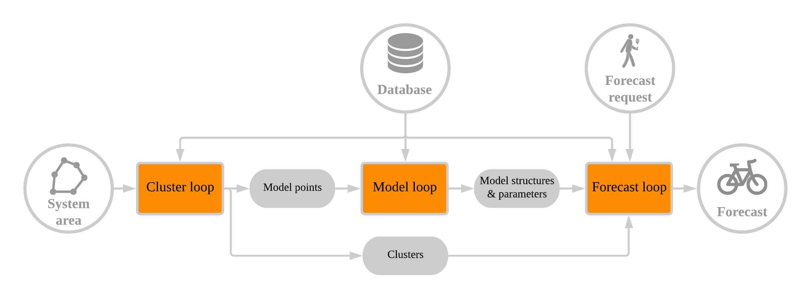

```{r setup, include=FALSE}
options(htmltools.dir.version = FALSE)
```

background-image: url('images/bike.png')
background-size: cover
class: center, center, inverse

# Towards more sustainable cities with dockless bike sharing

---

# What do we need to make dockless bike sharing a success?

- A lot of things!
- Among those: a **reliable** system
- Forecasting bike availability is important for this task

---

class: class: middle, center, inverse

# For a given moment in time and a given location in space: will there be a bike available for me?

---

# Challenges

```{r, echo = FALSE, message = FALSE, warning = FALSE, fig.width = 14}
library(mapview)
library(sf)

box = c(24.890953, 60.146733, 24.992763, 60.177470)
names(box) = c("xmin", "ymin", "xmax", "ymax")
class(box) = "bbox"

box = st_as_sf(st_as_sfc(box))
st_crs(box) = 4326

mapview(box, alpha.regions = 0, alpha = 0, legend = FALSE)
```

---

# Methodology

- Create spatial clusters of areas that have similar temporal patterns
- Fit a forecasting model (ARIMA in combination with seasonal decomposition) to a single time series within each cluster
- For each forecast request (at time *t* and location *(x,y)*), obtain a time series for that point in space-time, but use pre-fitted model parameters to forecast it.

```{r, echo = FALSE}

```

---

# Clustering

```{r, echo = FALSE, message = FALSE, fig.width = 14}
library(dockless)
library(leaflet)

clusters = readRDS('../../data/clusters.rds')
clusters = clusters$outlines

pal = colorFactor(
  palette = dockless_colors(categorical = TRUE)[1:4],
  domain = clusters$cluster
)

leaflet() %>%
  addPolygons(
    data = clusters,
    stroke = TRUE,
    color = 'black',
    weight = 2,
    fill = TRUE,
    fillColor = ~pal(cluster),
    fillOpacity = 1
  ) %>%
  addLegend(
    data = clusters,
    position = "bottomleft",
    colors = dockless_colors(categorical = TRUE)[1:4],
    labels = c('Bayview', 'Downtown', 'Residential', 'Presidio'),
    labFormat = labelFormat(),
    title = "Cluster",
    opacity = 1
  ) %>%
  addProviderTiles(
    provider = providers$Esri.WorldGrayCanvas
  )

```

---

background-image: url('images/clusterplots.png')
background-size: contain

---

# Modelling

```{r, echo = FALSE, message = FALSE, fig.width = 14}
modelpoints = readRDS('../../data/modelpoints.rds')

pal = colorFactor(
  palette = dockless_colors(categorical = TRUE)[1:4],
  domain = clusters$cluster
)

leaflet() %>%
  addPolygons(
    data = clusters,
    stroke = TRUE,
    color = 'black',
    weight = 2,
    fill = TRUE,
    fillColor = '#cccccc',
    fillOpacity = 0.5
  ) %>%
  addCircleMarkers(
    data = modelpoints,
    stroke = TRUE,
    color = 'black',
    fill = TRUE,
    fillColor = ~pal(cluster),
    fillOpacity = 1
  ) %>%
  addLegend(
    data = modelpoints,
    position = "bottomleft",
    colors = dockless_colors(categorical = TRUE)[1:4],
    labels = c('Bayview', 'Downtown', 'Residential', 'Presidio'),
    labFormat = labelFormat(),
    title = "Model point",
    opacity = 1
  ) %>%
  addProviderTiles(
    provider = providers$Esri.WorldGrayCanvas
  )
```

---

background-image: url('images/timeplots.png')
background-size: contain

---

# Forecasting

```{r, echo = FALSE, message = FALSE, fig.width = 14}
systemarea = readRDS('../../data/systemarea.rds')
testpoints = readRDS('../../data/testpoints.rds')

leaflet() %>%
  addPolygons(
    data = systemarea,
    stroke = TRUE,
    color = 'black',
    weight = 2,
    fill = TRUE,
    fillColor = '#cccccc',
    fillOpacity = 0.5
  ) %>%
  addCircles(
    data = testpoints,
    stroke = TRUE,
    color = '#fc8c01'
  ) %>%
  addProviderTiles(
    provider = providers$Esri.WorldGrayCanvas
  )

```

---

background-image: url('images/forecastplots.png')
background-size: contain

---

class: middle, center, inverse

# Summary:
# I created a generally applicable methodology to forecast bike availability in dockless bike sharing systems. It outperformed baseline methods, but also highlighted the limited forecastability of dockless bike sharing data.

---

class: middle, center

```{r, echo = FALSE, out.width='20%'}
knitr::include_graphics("images/hexagon.png")
```

#### All code available in an R package on GitHub
#### https://github.com/luukvdmeer/dockless

#### Reproducible thesis document also on GitHub
#### https://github.com/luukvdmeer/msc-thesis

Slides created with the R package `xaringan` -
Plots created with the R package `ggplot2` -
Maps created with the R package `leaflet` -
Icons adapted from `iconfinder.com` -
Images from `jump.com`